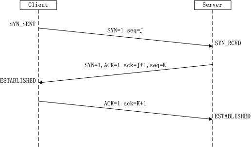
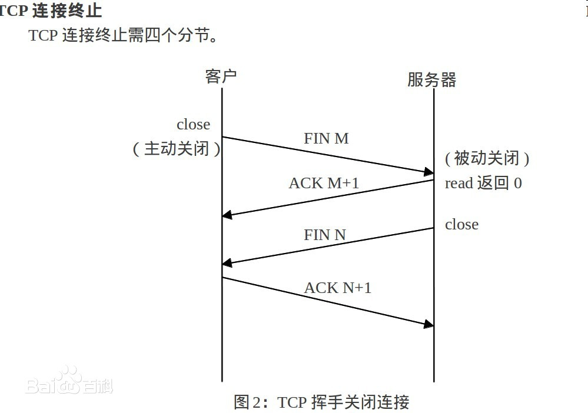

# 网络和安全相关面试题

[[toc]]
## OSI七层参考模型
- 应用层
- 表示层
- 会话层
- 传输层
- 网络层
- 数据链路层
- 物理层

## TCP协议和UDP协议，以及他们之间的区别
### TCP协议
`TCP`协议是传输控制协议，建立连接需要先需要进行握手，断开连接时需要进行四次挥手。

TCP头部的结构如下：

特点：
- TCP 协议是面向连接的，在通信双方进行通信前，需要通过三次握手建立连接。它需要在端系统中维护双方连接的状态信息。
- TCP 协议通过序号、确认号、定时重传、检验和等机制，来提供可靠的数据传输服务。
- TCP 协议提供的是点对点的服务，即它是在单个发送方和单个接收方之间的连接。
- TCP 协议提供的是全双工的服务，也就是说连接的双方的能够向对方发送和接收数据。
- TCP 提供了拥塞控制机制，在网络拥塞的时候会控制发送数据的速率，有助于减少数据包的丢失和减轻网络中的拥塞程度。
- TCP 提供了流量控制机制，保证了通信双方的发送和接收速率相同。如果接收方可接收的缓存很小时，发送方会降低发送 速率，避免因为缓存填满而造成的数据包的丢失。

### 三次握手和四次挥手
建立TCP连接时，需要进行三次握手，流程如下：

注意区分上图中ACK的大小写，大写表示标志位/标识符，小写表示确认号。具体见TCP头部结构图片。

关闭TCP连接时，需要进行四次挥手，流程如下：

#### 为什么发起TCP连接时不能两次握手
为了实现可靠数据传输，TCP 协议的通信双方，都必须维护一个序列号，以标识发送出去的数据包中，哪些是已经被对方收到的。三次握手的过程即是通信双方相互告知序列号起始值，并确认对方已经收到了序列号起始值的必经步骤。

如果只是两次握手， 至多只有连接发起方的起始序列号能被确认， 另一方选择的序列号则得不到确认。可能会导致失效的连接请求报文段被服务端接收的情况，从而产生错误。

#### 为什么关闭TCP连接时不能三次挥手
TCP是全双工通信的，关闭连接时，需要服务端和客服端都确定对方将不再发送数据。在客服端第1次挥手时，服务端可能还在发送数据。所以第2次挥手和第3次挥手不能合并。

### UDP协议
UDP是用户数据报协议，UDP是一种无连接的，不可靠的传输层协议。

特点：
- 使用 UDP 时，在发送报文段之前，通信双方没有握手的过程，因此 UDP 被称为是无连接的传输层协议。因为没有握手 过程，相对于 TCP 来说，没有建立连接的时延。因为没有连接，所以不需要在端系统中保存连接的状态。
- UDP 提供尽力而为的交付服务，也就是说 UDP 协议不保证数据的可靠交付。
- UDP 没有拥塞控制和流量控制的机制，所以 UDP 报文段的发送速率没有限制。
- 因为一个 UDP 套接字只使用目的地址和目的端口来标识，所以 UDP 可以支持一对一、一对多、多对一和多对多的交互通信。
- UDP 首部小，只有 8 个字节。
             
## HTTP协议
HTTP 是超文本传输协议，它定义了客户端和服务器之间交换报文的格式和方式，默认使用 80 端口。它使用 TCP 作为传输层协议(HTTP3已经使用UDP协议了)，保证了数据传输的可靠性。

HTTP 报文有两种，一种是请求报文，一种是响应报文。HTTP报文由首部(`headers`)与实体组成(`body`)，首部和实体间使用一个空行进行分割，该空行不能省略。下面是HTTP报文结构图：

- 请求报文的首部的第一行成为请求行，请求行包含三个字段：方法字段(`Method`)、URL 字段和 HTTP 版本字段。如: `POST / HTTP/1.1`，方法字段(`Method`)可以取几种不同的值，一般有 GET、POST、HEAD、PUT 和 DELETE
- 响应报文的首部的第一行成为请求行状态行，状态行包含了三个字段：协议版本字段、状态码和相应的状态信息。如：`HTTP/1.0 200 OK`

### 常见的HTTP状态码以及其含义
| HTTP状态码 | 状态信息 | 解释 |
| --- | --- | --- |
| 200 | OK | 服务器已成功处理了请求。
| 206 | Partial Content | 服务器成功处理了部分请求。
| 301 | Moved Permanently | 已永久移动到新位置，即永久重定向。
| 302 | Found | 暂时跳转到其他页面，即暂时重定向。
| 304 | Not Modified | GET请求时，文档的内容（自上次访问以来或者根据请求的条件）并没有改变 |
| 400 | Bad Request |  错误请求，服务器无法解析该请求。
| 401 | Unauthorized | 未授权请求，没有进行身份验证或验证未通过。
| 403 | Forbidden | 禁止访问服务器，拒绝此请求。
| 404 | Not Found | 未找所请求的资源。
| 500 | Internal Server Error | 服务器内部错误服务器遇到错误，无法完成请求。
| 502 | Bad Gateway | 错误网关服务器作为网关或代理，从上游服务器收到无效响应。
更多HTTP状态码含义见[HTTP 响应代码](https://developer.mozilla.org/zh-CN/docs/Web/HTTP/Status)

### HTTP1.1
HTTP1.1相比HTTP1.0新增里以下特性：
- 缓存处理，在HTTP1.0中主要使用header里的If-Modified-Since,Expires来做为缓存判断的标准，HTTP1.1则引入了更多的缓存控制策略例如E-tag，If-Unmodified-Since, If-Match, If-None-Match等更多可供选择的缓存头来控制缓存策略。
- 带宽优化及网络连接的使用，HTTP1.0中，存在一些浪费带宽的现象，例如客户端只是需要某个对象的一部分，而服务器却将整个对象送过来了，并且不支持断点续传功能，HTTP1.1则在请求头引入了range头域，它允许只请求资源的某个部分，即返回码是206（Partial Content），这样就方便了开发者自由的选择以便于充分利用带宽和连接。
- 错误通知的管理，在HTTP1.1中新增了24个错误状态响应码，如409（Conflict）表示请求的资源与资源的当前状态发生冲突；410（Gone）表示服务器上的某个资源被永久性的删除。
- Host头处理，在HTTP1.0中认为每台服务器都绑定一个唯一的IP地址，因此，请求消息中的URL并没有传递主机名（hostname）。但随着虚拟主机技术的发展，在一台物理服务器上可以存在多个虚拟主机（Multi-homed Web Servers），并且它们共享一个IP地址。HTTP1.1的请求消息和响应消息都应支持Host头域，且请求消息中如果没有Host头域会报告一个错误（400 Bad Request）
- 长连接，HTTP 1.1支持长连接（PersistentConnection）和请求的流水线（Pipelining）处理，在一个TCP连接上可以传送多个HTTP请求和响应，减少了建立和关闭连接的消耗和延迟，在HTTP1.1中默认开启Connection： keep-alive，一定程度上弥补了HTTP1.0每次请求都要创建连接的缺点。

### HTTP2
HTTP2.0和HTTP1.X相比的新特性:
- 新的二进制格式（Binary Format），HTTP1.x的解析是基于文本。基于文本协议的格式解析存在天然缺陷，文本的表现形式有多样性，要做到健壮性考虑的场景必然很多，二进制则不同，只认0和1的组合。基于这种考虑HTTP2.0的协议解析决定采用二进制格式，实现方便且健壮。
- 多路复用（MultiPlexing），即连接共享，即每一个request都是是用作连接共享机制的。一个request对应一个id，这样一个连接上可以有多个request，每个连接的request可以随机的混杂在一起，接收方可以根据request的 id将request再归属到各自不同的服务端请求里面。
- header压缩，如上文中所言，对前面提到过HTTP1.x的header带有大量信息，而且每次都要重复发送，HTTP2.0使用encoder来减少需要传输的header大小，通讯双方各自cache一份header fields表，既避免了重复header的传输，又减小了需要传输的大小。
- 服务端推送（server push），同SPDY一样，HTTP2.0也具有server push功能。
### HTTP3
由于 TCP 本身存在的一些限制，Google 就开发了一个基于 UDP 协议的 QUIC 协议，并且使用在了 HTTP/3 上。 QUIC 协议在 UDP 协议上实现了多路复用、有序交付、重传等等功能

### HTTPS
HTTPS 指的是超文本传输安全协议，HTTPS 是基于 HTTP 协议的，不过它会使用 TLS/SSL 来对数据加密。HTTPS协议默认使用端口是443。

关于HTTPS更多信息详见：[《一个故事讲完https》](https://mp.weixin.qq.com/s/StqqafHePlBkWAPQZg3NrA) [图解SSL/TLS协议](http://www.ruanyifeng.com/blog/2014/09/illustration-ssl.html) 

### GET请求和POST请求有什么区别
- GET请求一般用户获取数据，POST请求一般用于提交数据
- GET请求的参数只能放在URL里，POST请求参数可以放到请求体中，所以POST请求可以发送更多类型的数据，如二进制数据
- HTTP协议规定，GET请求是幂等的，即多次请求应返回相同结果

## XSS
XSS(`cross-site scripting`)跨站脚本攻击，是指对Web页面注入脚本，使用JavaScript窃取用户信息，诱导用户操作等。
常见的XSS有：**持久型**和**非持久型**

- 持久型/储存型: 持久型也就是攻击的代码被服务端写入进**数据库**中，如果服务器没有正确进行过滤输出，那就会造成浏览这个页面的用户执行攻击代码。
- 非持久型: 攻击者通过特定手法（如电子邮件），诱使用户去访问一个包含恶意代码的 URL，当受害者点击这些专门设计的链接的时候，恶意代码会直接在受害者主机上的浏览器执行，如`www.abc.com/?params=`。非持久型的攻击代码不会被存储到服务器的数据库中。

防范XSS的方法：
- 不可信任用户输入的内容，比如来自搜索框、富文本编辑器的用户内容。对输入和输入的信息进行转义。可以用[js-xss](https://github.com/leizongmin/js-xss) 之类的库进行处理。
- 使用CSP(`Content Security Policy`)内容安全策略：实质就是白名单制度，开发者明确告诉客户端，哪些外部资源可以加载和执行。详见[《Content Security Policy 入门教程》](http://www.ruanyifeng.com/blog/2016/09/csp.html)

## CSRF
CSRF(`cross-site request forgery`)跨站请求伪造，攻击者构造出一个后端请求地址，诱导用户点击或者通过某些途径自动发起请求。如果用户是在登录状态下的话，后端就以为是用户在操作，从而进行相应的逻辑。

比如说诱导用户访问一个GET请求: ``

防范CSRF的方法：
- 网站的API尽量不用GET请求，因为GET请求更容易进行CSRF攻击
- 验证 HTTP Referer 字段。在 HTTP 头中的 Referer 字段，它记录了该 HTTP 请求的来源地址，可以用它验证请求是否是来自可信的域名。
- Token验证。在每次请求中带上Token，在服务端验证Token的有效性。Token可以放在HTTP请求头中、请求的URL中等。

