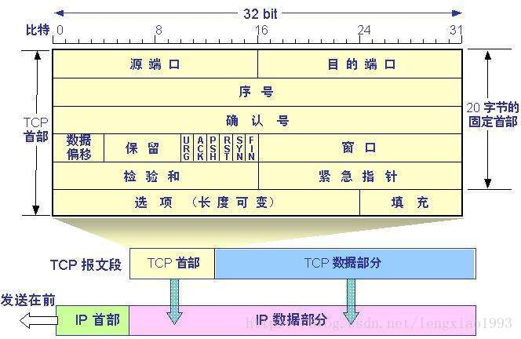

# 网络和安全相关面试题

[[toc]]
## OSI七层参考模型
- 应用层
- 表示层
- 会话层
- 传输层
- 网络层
- 数据链路层
- 物理层

## TCP协议和UDP协议，以及他们之间的区别
### TCP协议
`TCP`协议是传输控制协议，建立连接需要先需要进行握手，断开连接时需要进行四次挥手。

TCP头部的结构如下：

### 三次握手和四次挥手
建立TCP连接时，需要进行三次握手，流程如下：

注意区分上图中ACK的大小写，大写表示标志位/标识符，小写表示确认号。具体见TCP头部结构图片。

关闭TCP连接时，需要进行四次挥手，流程如下：

#### 为什么发起TCP连接时不能两次握手
为了实现可靠数据传输，TCP 协议的通信双方，都必须维护一个序列号，以标识发送出去的数据包中，哪些是已经被对方收到的。三次握手的过程即是通信双方相互告知序列号起始值，并确认对方已经收到了序列号起始值的必经步骤。

如果只是两次握手， 至多只有连接发起方的起始序列号能被确认， 另一方选择的序列号则得不到确认。可能会导致失效的连接请求报文段被服务端接收的情况，从而产生错误。

#### 为什么关闭TCP连接时不能三次挥手
TCP是全双工通信的，关闭连接时，需要服务端和客服端都确定对方将不再发送数据。在客服端第1次挥手时，服务端可能还在发送数据。所以第2次挥手和第3次挥手不能合并。
             
## HTTP协议
HTTP 是超文本传输协议，它定义了客户端和服务器之间交换报文的格式和方式，默认使用 80 端口。它使用 TCP 作为传输层协议(HTTP3已经使用UDP协议了)，保证了数据传输的可靠性。
### HTTP2
### HTTP3
### HTTPS
## XSS
XSS是跨站脚本攻击，常见的XSS有两种
## CSRF

