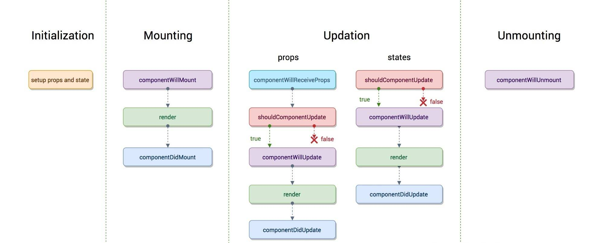

# React面试题

[[toc]]

## React和Vue有什么不同
不同点：
- React是一个专注视图层(View)的库，而Vue是MVVM框架
- React使用JSX语法，Vue一般使用模板(Vue中也可以用JSX，不过不常见)
- React使用单向数据流，Vue中常用双向数据绑定

相似点：
- 都采用了虚拟DOM(`Virtual DOM`)
- 都有各自的组件化方案

## 什么是Virtual DOM
虚拟DOM(`Virtual DOM`)是指用JavaScript 对象结构表示 DOM 树的结构。由于真实DOM操作比较消耗性能，React引入了虚拟DOM，在数据变化时，虚拟DOM首先发生变化，React会对比新旧的虚拟DOM树的差异，然后将DOM操作批量应用到真实DOM中。

## React中的Component和Element有什么区别
- React Element 是一个普通的JS对象，用于描述屏幕上所见内容，
- React Component 则是可以接收参数输入并且返回某个 React Element 的函数或者类

## React中的key的作用是什么
Key 是 React 用于追踪哪些列表中元素被修改、被添加或者被移除的辅助标识。在开发过程中，我们需要保证某个元素的 key 在其同级元素中具有唯一性。在 React Diff 算法中 React 会借助元素的 Key 值来判断该元素是新近创建的还是被移动而来的元素，从而减少不必要的元素重渲染。
## Controlled Component(受控组件) 与 Uncontrolled Component(非受控组件)之间的区别是什么
React中的受控组件和非受控组件的概念主要是针对HTML的表单元素(比如input)。

1. 受控组件（Controlled Component）代指那些交由 React 控制并且所有的表单数据统一存放的组件。
```jsx harmony
class ControlledForm extends Component {
  state = {
    username: ''
  }
  updateUsername = (e) => {
    this.setState({
      username: e.target.value,
    })
  }
  handleSubmit = () => {}
  render () {
    return (
      <form onSubmit={this.handleSubmit}>
        <input
          type='text'
          value={this.state.username}
          onChange={this.updateUsername} />
        <button type='submit'>Submit</button>
      </form>
    )
  }
}
```
2. 而非受控组件（Uncontrolled Component）则是由DOM存放表单数据，并非存放在 React 组件中。我们可以使用 refs 来操控DOM元素：
```jsx harmony
class UnControlledForm extends Component {
  handleSubmit = () => {
    console.log("Input Value: ", this.input.value)
  }
  render () {
    return (
      <form onSubmit={this.handleSubmit}>
        <input
          type='text'
          ref={(input) => this.input = input} />
        <button type='submit'>Submit</button>
      </form>
    )
  }
}
```
## React的生命周期
### React 15.x 生命周期
- `componentWillMount()` – 在渲染之前执行，在客户端和服务器端都会执行。
- `componentDidMount()` – 仅在第一次渲染后在客户端执行。
- `componentWillReceiveProps()` – 当从父类接收到`props`时调用。
- `shouldComponentUpdate()` – 根据特定条件返回 true 或 false 来决定组件是否应该被更新。默认情况下，它返回 false。
- `componentWillUpdate()` – 在 DOM 中进行渲染之前调用。
- `componentDidUpdate()` – 在渲染发生后立即调用。
- `componentWillUnmount()` – 从 DOM 卸载组件后调用。用于清理内存空间。



### React 16.X的生命周期，以及为何要替换掉以前的？
在React 16中，以下三个生命周期不鼓励使用
- `componentWillMount`
- `componentWillReceiveProps`
- `componentWillUpdate`

取而代之新增了下面两个生命周期
- `static getDerivedStateFromProps(nextProps, prevState)`: 接收父组件传递过来的 props 和组件之前的状态，返回一个对象来更新 state 或者返回 null。在组件实例化、接收到新的 props 、组件状态更新时会被调用。用于替换早前的`componentWillReceiveProps`。
- `getSnapshotBeforeUpdate(prevProps, prevState)` 接受父组件传来的`props`和组件内的`state`，此生命周期钩子必须有返回值，返回值将作为第三个参数传递给`componentDidUpdate`。被调用于 render 之后、实际的DOM更新之前。用于替换`componentWillUpdate`


#### 为什么要替换掉以前的生命周期？
React 修改生命周期是为`Async Rendering`和`Fiber`调度服务的。

在React16引入Fiber后，`reconciler`(diff + render + 创建虚拟DOM)阶段会调用多次，导致生命周期可能会被调用多次，这样某些`componentWill***`就不符合其语义了(原本的`will`暗示该生命周期在更新过程中只会调用一次)。

在未来的React 17中，会完全删除`componentWillMount`、`componentWillReceiveProps`、`componentWillUpdate`，为新的`Async Rendering`做准备。

## React组件间的通信机制有哪些
- 父子组件通信
- 兄弟组件通信
- 跨多层级组件通信
- 任意组件
## setState原理，什么时候是同步的？
## 什么是高阶组件(HOC)
## React中的事件机制
## React 16.X 的Fiber原理
## React Hooks相对高阶组件和Class组件有什么优势/缺点？
## React跨平台的实现原理。
## 说一说Redux和Flux，以及他们之间的不同
## React性能优化的方法有哪些

