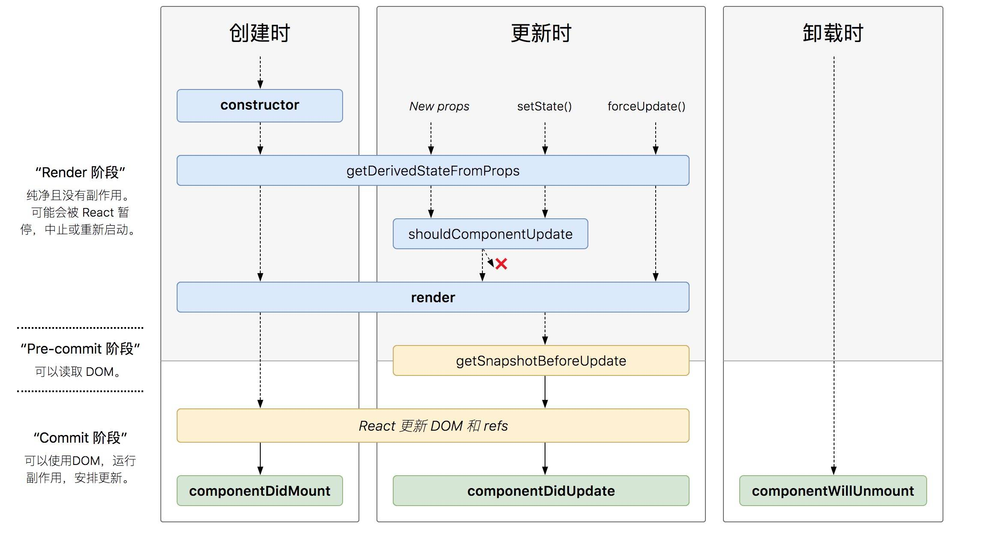

# React面试题

[[toc]]

## React和Vue有什么不同
不同点：
- React是一个专注视图层(View)的库，而Vue是MVVM框架
- React使用JSX语法，Vue一般使用模板(Vue中也可以用JSX，不过不常见)
- React使用单向数据流，Vue中常用双向数据绑定

相似点：
- 都采用了虚拟DOM(`Virtual DOM`)
- 都有各自的组件化方案

## 什么是Virtual DOM
虚拟DOM(`Virtual DOM`)是指用JavaScript 对象结构表示 DOM 树的结构。由于真实DOM操作比较消耗性能，React引入了虚拟DOM，在数据变化时，虚拟DOM首先发生变化，React会对比新旧的虚拟DOM树的差异，然后将DOM操作批量应用到真实DOM中。

## React中的Component和Element有什么区别
- React Element 是一个普通的JS对象，用于描述屏幕上所见内容，
- React Component 则是可以接收参数输入并且返回某个 React Element 的函数或者类

## React中的key的作用是什么
Key 是 React 用于追踪哪些列表中元素被修改、被添加或者被移除的辅助标识。在开发过程中，我们需要保证某个元素的 key 在其同级元素中具有唯一性。在 React Diff 算法中 React 会借助元素的 Key 值来判断该元素是新近创建的还是被移动而来的元素，从而减少不必要的元素重渲染。
## Controlled Component(受控组件) 与 Uncontrolled Component(非受控组件)之间的区别是什么
React中的受控组件和非受控组件的概念主要是针对HTML的表单元素(比如input)。

1. 受控组件（Controlled Component）代指那些交由 React 控制并且所有的表单数据统一存放的组件。
```jsx harmony
class ControlledForm extends Component {
  state = {
    username: ''
  }
  updateUsername = (e) => {
    this.setState({
      username: e.target.value,
    })
  }
  handleSubmit = () => {}
  render () {
    return (
      <form onSubmit={this.handleSubmit}>
        <input
          type='text'
          value={this.state.username}
          onChange={this.updateUsername} />
        <button type='submit'>Submit</button>
      </form>
    )
  }
}
```
2. 而非受控组件（Uncontrolled Component）则是由DOM存放表单数据，并非存放在 React 组件中。我们可以使用 refs 来操控DOM元素：
```jsx harmony
class UnControlledForm extends Component {
  handleSubmit = () => {
    console.log("Input Value: ", this.input.value)
  }
  render () {
    return (
      <form onSubmit={this.handleSubmit}>
        <input
          type='text'
          ref={(input) => this.input = input} />
        <button type='submit'>Submit</button>
      </form>
    )
  }
}
```
## React的生命周期
### React 15.x 生命周期
- `componentWillMount()` – 在渲染之前执行，在客户端和服务器端都会执行。
- `componentDidMount()` – 仅在第一次渲染后在客户端执行。
- `componentWillReceiveProps()` – 当从父类接收到`props`时调用。
- `shouldComponentUpdate()` – 根据特定条件返回 true 或 false 来决定组件是否应该被更新。默认情况下，它返回 false。
- `componentWillUpdate()` – 在 DOM 中进行渲染之前调用。
- `componentDidUpdate()` – 在渲染发生后立即调用。
- `componentWillUnmount()` – 从 DOM 卸载组件后调用。用于清理内存空间。


### React 16.X的生命周期，以及为何要替换掉以前的？
在React 16中，以下三个生命周期不鼓励使用
- `componentWillMount`
- `componentWillReceiveProps`
- `componentWillUpdate`

取而代之新增了下面两个生命周期
- `static getDerivedStateFromProps(nextProps, prevState)`: 接收父组件传递过来的 props 和组件之前的状态，返回一个对象来更新 state 或者返回 null。在组件实例化、接收到新的 props 、组件状态更新时会被调用。用于替换早前的`componentWillReceiveProps`。
- `getSnapshotBeforeUpdate(prevProps, prevState)` 接受父组件传来的`props`和组件内的`state`，此生命周期钩子必须有返回值，返回值将作为第三个参数传递给`componentDidUpdate`。被调用于 render 之后、实际的DOM更新之前。用于替换`componentWillUpdate`



#### 为什么要替换掉以前的生命周期？
React 修改生命周期是为`Async Rendering`和`Fiber`调度服务的。

在React16引入Fiber后，`reconciler`(diff + render() + 创建虚拟DOM)阶段会调用多次，导致生命周期可能会被调用多次，这样某些`componentWill***`就不符合其语义了(原本的`will`暗示该生命周期在更新过程中只会调用一次)。

在未来的React 17中，会完全删除`componentWillMount`、`componentWillReceiveProps`、`componentWillUpdate`，为新的`Async Rendering`做准备。

## React组件间的通信机制有哪些
- 父子组件通信：父组件通过props向子组件传递数据，子组件通过回调函数向父组件传递数据
- 兄弟组件通信：通过共同的父组件传递数据
- 跨多层级组件通信：使用React的Context API传递数据
- 任意组件：使用Redux等数据管理库

## setState原理，什么时候是同步的？
在代码中调用setState函数之后，React 会将传入的参数对象与组件当前的状态合并，然后触发所谓的调和过程（Reconciliation）。

一般情况下，React会将用户多次调用`setState`合并成一个，导致在setState后没法立马拿到更新后的state值，形式了所谓的"异步"。
- 由React控制的事件处理程序，以及生命周期函数调用setState不会同步更新state
- React控制之外的事件中调用setState是同步更新的。比如原生js绑定的事件，setTimeout/setInterval等。

如果想要在setState更新后在执行某一动作，可以将函数作为steState的第二个参数，React会确保在state更新之后才会调用该函数：
```js
this.setState({ count: this.state.count + 1}, () => {
    console.log(this.state.count);
})
```

使用函数作为setState的第一个参数，可以同步获取到最新的state:
```js
increment(state, props) {
  return {
    count: state.count + 1
  }
}

// 调用后state.count会增加3,
handleClick() {
  this.setState(this.increment)
  this.setState(this.increment)
  this.setState(this.increment)
}
```

## 什么是高阶组件(HOC)
React中的高阶组件定义：一个高阶组件将接受一个React组件作为参数，并返回一个新的、被包装过的React组件。

高阶组件主要用于达到以下两种目的：
- 属性代理 `Props Proxy`：高阶组件可以代理被包裹的组件接受`props`，并将修改过的`props`传入被包裹组件
- 反向继承 `Inheritance Inversion`：通过反向继承被包裹组件，可以劫持返回后组件的渲染方法、操作其`state`等，访问`this`等。

属性代理例子：
```jsx harmony
// 用于属性代理的高阶组件
function propsProxyHOC(WrappedComponent) {
  return class PP extends React.Component {
    render() {
      const newProps = { // 可以额外注入props
        userName: 'Tom'
      }
      return <WrappedComponent {...this.props} {...newProps}/>
    }
  }
}

// 1.以装饰器的方式使用
@propsProxyHOC
class MyComponent extends React.Component {
  render() {
    return <div>{this.props.userName}</div>
  }
}

// 2. 或者当做函数使用
const MyComponentWithUserInfo = propsProxyHOC(MyComponent)
```

反向继承例子：
```jsx harmony
function iiHOC(WrappedComponent) {
  return class Enhancer extends WrappedComponent { // 主动去继承被包裹组件
    render() {
      return super.render() // 渲染方法被劫持
    }
  }
}
```

## React中的事件机制
为了解决跨浏览器兼容性问题，React 会将浏览器原生事件（Browser Native Event）封装为合成事件（SyntheticEvent）传入设置的事件处理器中。这里的合成事件提供了与原生事件相同的接口，不过它们屏蔽了底层浏览器的细节差异，保证了行为的一致性。另外有意思的是，React 并没有直接将事件附着到子元素上，而是以单一事件监听器的方式将所有的事件发送到顶层进行处理。这样 React 在更新 DOM 的时候就不需要考虑如何去处理附着在 DOM 上的事件监听器，最终达到优化性能的目的。

## React 16.X 的Fiber原理
React Fiber是在React 16中引入的一个新的任务调和器(`reconciler`)，之前React使用递归的方式进行`reconcile`，而JS又是单线程的，一旦`reconcile`开始，就必须等待其任务全部执行完毕。在当组件树比较庞大的时候，可能会造成界面卡顿。

引入`Fiber`之后，可以将`reconcile`拆分成更小的任务，`reconcile`过程可以暂停，分阶段完成。并将任务按照优先等级划分，优先执行高优先级的任务(比如浏览器渲染任务)。

## React Hooks相对Class组件有什么优势？
- Hooks让函数组件也可以有自己的状态
- 更容易复用代码，可以将业务逻辑封装/副作用到自定义Hooks中
- `useEffect`相对于`class`组件简化了生命周期，代码风格更加简洁

## 说一说Redux和Flux，以及他们之间的不同
|  Redux   | Flux  |
|  ----  | ----  |
| Store 和更改逻辑是分开的  | Store 包含状态和更改逻辑 |
| 只有一个 Store  | 存在多个 Store |
| 带有分层 reducer 的单一 Store  |  所有 Store 都互不影响且是平级的 |
| 没有调度器(`dispatcher`)的概念  | 它有一个单独的调度器(`dispatcher`) |
| 状态是不可变的 | 状态是可变的 |

### Redux流程图示


### Flux流程图示

- 注意`action`是由`action-creators`创建，然后由调度器(`dispatcher`)进行配发
- store的更新函数(用于改变store内的数据)会注册到`dispacher`上，由`dispatcher`触发这些回调并将`action`作为参数传入
- `Store`内数据变化后会发出`change`事件，在`view`内可以通过注册监听回调来监听，然后触发`view`变化


## React中常用优化的方法有哪些
- 使用`shouldComponentUpdate`避免重复渲染，在shouldComponentUpdate返回false时，组件不会更新
- 使用`React.PureComponent`，PureComponent自带通过props和state的浅对比来实现 shouldComponentUpdate
- props尽量只传需要的数据，避免多余的更新
- 使用`React.memo(functionComponent, comparator: (prevProps, nextProps) => boolean)`，让纯函数组件也可以自行决定更新时机，类似shouldComponentUpdate，当comparator函数返回true时，函数组件才会重新渲染。
- 使用`React.Fragment`减少多余的用于包裹的节点
- 纯函数组件中使用以下hooks来达到性能优化的目的
    - useCallback
    - useMemo
- 减少在render()中使用内联函数
- 给列表中的元素添加key，帮助react跟踪元素的修改
- 使用`React.lazy()`和webpack的code split来分割代码，延迟加载组件。
- 使用Immutable方案

## React-Router的路由有几种，区别是什么
1. BrowserRouter
`BrowserRouter`充分利用了HTML5中history新增的API(`pushState`、`replaceState`、`popstate`)，上面三个API的作用是改变浏览器地址栏里的URL，同时会改变浏览器的历史记录，但是不会真的去请求新的页面。例如：`www.abc.com/user/login`
2. HashRouter
`HashRouter`使用URL中的hash部分(`window.location.hash`)来让你的UI组件和路由保持一致。
例如`www.abc.com/#/user/login`。如果需要兼容非常旧版本的浏览器，可以使用这种路由。
3. MemoryRouter
`MemoryRouter`将路由的记录和变化都保存在内存中，不会改变浏览器的地址栏。一般用于写测试或是非浏览器环境(比如ReactNative)

## 说说React服务端渲染(`SSR`)
`SSR(server side render)`是指用户在访问单页应用(`SPA`)时，由服务端先渲染好组件的首屏`HTML`，并返回给客户端。服务端渲染可以缩短首屏渲染时间，让单页应用对SEO更加友好。


React服务端渲染流程大致如下：
1. 服务端获得请求的URL
2. 服务端运行React组件代码(`renderToString`)生成HTML
3. 发送HTML给浏览器
4. 浏览器接收内容显示
5. 浏览器加载JS
6. JS中的React代码在浏览器中重新执行(进行`hydrate`)
7. JS中的React代码接管页面操作

### 什么是`hydrate`
`hydrate`(注水)：服务端使用`renderToString`渲染出的字符串代码(html)并没有事件绑定，需要在客户端再运行一次React代码(js)进行事件绑定，但是客户端重复运行React代码就会重复生成字符串模板，`hydrate`可以复用服务端已经生成的字符串模板，避免重复渲染。
