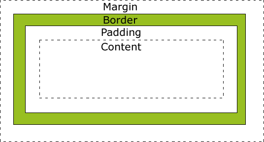
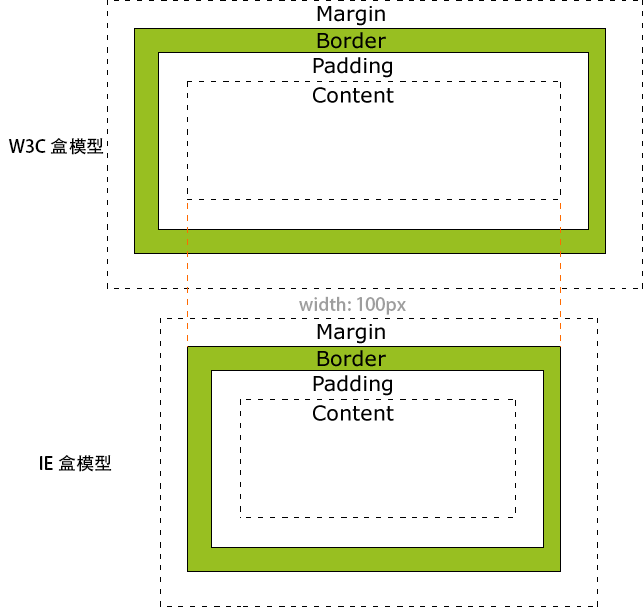
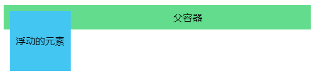

# CSS基础面试题
[[toc]]
## 什么是CSS盒子模型
每个HTML元素都可以看成一个矩形盒子(`box`)，CSS盒模型本质上就是这样一个盒子，封装周围的HTML元素，它包括：外边距`margin`，边框`border`，填充`padding`，和实际内容`content`（按盒子从外到内的顺序）。
- `Margin`(外边距)  盒子与盒子之间的间隙，是完全透明的。
- `Border`(边框)  围绕在盒子`Padding`和内容外的边框。
- `Padding`(填充/内边距)  盒子中实际内容和边框间的间隙。
- `Content`(内容)  盒子的实际内容。



### W3C标准盒模型和IE盒模型
目前盒模型有两类：W3C标准盒模型和IE盒模型，他们之间的区别：
- IE盒模型尺寸计算时，按照盒模型的`Border`(边框)的尺寸计算
- W3C标准盒模型尺寸按照盒子`Content`(内容)的尺寸计算



使用CSS的`box-sizing`可以改变元素盒模型的类型，`box-sizing`可以取以下两个值
- `content-box` 使用W3C盒模型
- `border-box` 使用IE盒模型

除老版本IE外，现代浏览器默认的盒模型为W3C标准盒模型。

## 替换元素和非替换元素
替换元素/可替换元素(`replaced element`)：元素内的显示内容需要引用其他位置的资源或是由用户输入决定，如`img`就是一个替换元素，`img`标签的内容最后会被显示成其`src`属性所引用到的一张图片。常见的替换元素还有`video`、`iframe`、`input`。

在 CSS 中，替换元素的展现效果不是由 CSS 来控制的。这些元素是一种外部对象，它们外观的渲染，是独立于 CSS 的。
简单来说，它们的内容不受当前文档的样式的影响。CSS 可以影响替换元素的位置，但不会影响到可替换元素自身的内容。某些可替换元素，例如
iframe 元素，可能具有自己的样式表，但它们不会继承父文档的样式。

非替换元素(`non-replaced element`)：指该元素将直接告诉浏览器应该显示什么内容，常见的`div`、`p`、`span`等都是非替换元素。

## 块级元素和行内元素
- 块级元素；`display: block` 一个块级元素独占一行，有独立的高宽，`div`、`p`、`section` 都是常见的块级元素
- 行内元素：`display: inline` 行内元素占用的尺寸是其内容的实际高宽，多个行内元素在宽度足够的一行内会一个挨着一个显示。对行内元素设置CSS属性`height`、`width`、`上下margin`、`上下padding` 将不会生效。
- 注意：如果一个元素是行内元素，也是[可替换元素](#替换元素和非替换元素)，那它和块级元素一样可以设置宽高以及正常设置margin

## 什么是BFC
BFC(`Block Formatting Context`) 是 块级格式化上下文。BFC表示的是浏览器中块状(block)的一块渲染区域，并且有一套渲染规则。

指定一个元素为BFC，该元素满足如下规则中的一种即可:
- html根元素
- float的值**不是**none
- position属性为absolute或fixed
- display属性为 inline-block、table-cell、flex、inline-flex
- overflow的值**不是**visible

### BFC的布局规则
- 内部的Box会在垂直方向，一个接一个地放置(按照正常文档流规则)。
- Box垂直方向的距离由margin决定。属于同一个BFC的两个相邻Box的margin会发生重叠。
每个元素的margin box的左边， 与包含块border box的左边相接触(对于从左往右的格式化，否则相反)。即使存在浮动也是如此。
- BFC的区域不会与float box重叠。
- BFC就是页面上的一个隔离的独立容器，容器里面的子元素不会影响到外面的元素。反之也如此。
- 计算BFC的高度时，浮动元素也参与计算

## 清除浮动指的是什么，有哪些清除浮动的方法
浮动的元素(`float`为`left`或`right`)会脱离正常的文档流，导致浮动元素的**父容器**不能正确地计算高度而影响到布局(如下图)。一般所说的清除浮动是指清除浮动元素对其父元素造成的影响。




目前清除浮动的方法从原理上可以分为两类：
1. [在浮动元素**父容器**的底部加入`clear: both`的空元素](#在浮动元素父容器的底部加入clear-both的空元素)
2. [触发BFC](#触发BFC)

### 在浮动元素**父容器**的底部加入`clear: both`的空元素
假设`.father`为父容器元素的class，`.son`为浮动的子元素，`.empty`为一个空的块级元素：
```html
<div class="father">
  <div class="son"></div>
  <div class="empty"></div>
</div>
```
```css
.son {
  float: left;
}
.empty {
  display: block; // 如果用的空元素本身就是款级元素，这行也可以省略
  clear: both;
}
```
CSS的`clear`属性的作用是，不允许元素左边`left` 、右边`right` 或 左右两边`both` 的方向上出现浮动元素。

当我们在浮动元素(`.son`)的**父容器**(`.father`)的**末尾**插入了一个带有`clear: both`的块级元素(`.empty`)，由于这个块级元素(`.empty`)左右都不能出现浮动元素(`.son`)，所以浮动元素(`.son`)就会被挤到上方(也可以认为此时浮动元素(`.son`)把块级元素(`.empty`)挤到了下方)。此时，父容器(`.father`)计算高度时，会考虑到内部块级元素(`.empty`)所处的位置，导致父容器被强行撑开。

每次对要清除浮动的父元素尾部添加空元素会产生多余的无意义DOM结构，也比较繁琐，现在一般使用CSS3的伪元素`::after`在父容器尾部插入空元素来达到相似的效果：
```css
.father::after{
  content: " ";
  display: block;
  clear: both;
}
```

### 触发BFC
BFC元素是一个隔离的独立渲染区域，不会影响外部，计算BFC的高度时，内部浮动元素也参与计算。所以可以将触发浮动元素的父元素设置BFC来达到清除浮动的效果。

[触发BFC的方法](#什么是BFC)

## 什么是外边距(`margin`)塌陷/外边距合并

外边距塌陷又称外边距合并，指的是当**垂直方向上**的两个**相邻**的外边距相遇时，它们将合并变成**一个**外边距。

外边距塌陷分为以下几种情况
1. 相邻的兄弟元素，其相邻的上边距(`margin-top`)和下边距(`margin-bottom`)会合并
2. 父元素没有上边框`border-top`和上内边距`padding-top`，父元素的**第一个**子元素的`margin-top`会和父元素的`margin-top`合并
3. 父元素没有下边框`border-bottom`和下内边距`padding-bottom`，父元素的**最后一个**子元素的`margin-bottom`会和父元素的`margin-bottom`合并
4. 仅定义了上下边距的空元素(没有内边距和边框)，空元素的上下边距会合并

合并后的边距取值通过下面规则确定：
- 两个边距值都是正数，取较大的值
- 两个边距值都是负数，取绝对值较大的值
- 两个边距值一正一负，去两个值的和

注意，左右相邻的外边距是不会发生塌陷的。

### 外边距合并的解决方案
- 如果是兄弟元素间发生外边距合并，可以直接调整其中一个元素的`margin`以到想要效果，也可以使用`padding`来代替`margin`
- 如果是父元素和子元素发生边距合并，给父元素塌陷的相应方向上加上`padding`或`border`即可，也可以触发父元素的`BFC`

## 伪类与伪元素的区别
- 伪类用于找到那些不存在于DOM树中的信息以及不能被常规CSS选择器获取到的信息。例如`:link`、`:hover`、`:nth-child`
- 伪元素在DOM树中创建了一些在原本DOM树中不存在的抽象元素，例如`::before`、`::afrer`

伪类和伪元素都以冒号`:`开头，但一般为了进行区分伪类和伪元素，在CSS3中，伪元素以双冒号`::`开头。

## CSS选择器的优先级是如何计算的
CSS选择器的优先级有如下的计算规则。
### 1. 就近原则
CSS样式所处的位置对优先级会产生影响：

内联样式(写在元素标签style属性中的样式) > 内部样式(在HTML的`<style>`标签中写的样式) > 外部样式(使用link引入的外部css文件)

### 2. 根据选择器类型分
优先级关系：内联样式 > ID 选择器 > 类选择器 = 属性选择器 = 伪类选择器 > 标签选择器 = 伪元素选择器 > 继承的样式。

如果一个元素存在多个选择器，将先根据选择器类型分类统计选择器数量：计算选择符中 ID 选择器的个数（A），计算选择符中类选择器、属性选择器以及伪类选择器的个数之和（B），计算选择符中标签选择器和伪元素选择器的个数之和（C）。按 A、B、C 的顺序依次比较大小，大的则优先级高。

两个的选择符中 a、b、c 都相等，则按照"就近原则"来判断。

### 3. `!important`
CSS属性后插有`!important`的属性拥有最高优先级，若针对同一个元素同一种样式有多个`!important`，则根据上述选择器类型和就近原则决定优先级。

## link和@import有什么区别
1. link是HTML标签，@import是CSS规则
2. link会最大限度支持并行下载，@import引入的 CSS 将在页面加载完毕后被加载
3. 浏览器对link支持较早，不用担心兼容性，而@import是CSS3的新特性
4. @import一定要写在除@charset外的其他任何 CSS 规则之前，如果置于其它位置将会被浏览器忽略

一般情况下更建议使用link引入外部样式

## CSS3有哪些新特性
1. 新的选择器：新的伪类、伪元素选择器，新的属性选择器等。例如`::selection`、`[attribute^=value]`
2. 新的样式效果：阴影`box-shadow`，圆角，自定义字体，渐变，滤镜，多重背景等
3. 新增了 过渡 和 动画
4. 新增布局方式
5. 新增的长度单位 rem, vh, vw
6. 新增用于响应式布局的 @media

CSS3的新特性有很多，上面仅列举了一些常用的部分。

## line-height是如何计算的
## 谈谈使用flex布局
## 用过哪些CSS预处理器他们之间的区别是什么
## 谈谈物理像素、逻辑像素、PPI、DPR
## 说说对响应式布局的理解
## 隐藏一个元素有哪些方法以及其区别
## 什么是CSS Hack、常见的CSS Hack
早期不同浏览器对CSS解析能力不同，有些还有一些独特的BUG，CSS Hack是指利用这些特性来进行一些针对不同浏览器的兼容性处理。下面列举一些常见的CSS Hack方式：
### 浏览器前缀
| 前缀  | 浏览器  |
| ------------ | ------------ |
| -ms-  | IE  |
|  -webkit- | Chrome/Safari  |
| -moz-  | Firfox  |
| -o- | Opera  |

示例：
```css
-webkit-box-shadow: 0 5px 5px rgba(0, 0, 0, 0.5);
-moz-box-shadow: 0 5px 5px rgba(0, 0, 0, 0.5);
-o-box-shadow: 0 5px 5px rgba(0, 0, 0, 0.5);
box-shadow: 0 5px 5px rgba(0, 0, 0, 0.5);
```
### IE条件注释
IE的条件注释是IE的私有写法，可以让HTML文档内的部分代码针对特定版本的IE
```html
<!--[if expression]>
针对特定版本IE的代码写在这里
<!-->
```
`expression`可以取以下几种值:
- `lt` ：Less than的简写，也就是小于的意思。
- `lte` ：Less than or equal to的简写，也就是小于或等于的意思。
- `gt`：Greater than的简写，也就是大于的意思。
- `gte`：Greater than or equal to简写，也就是大于或等于的意思。
- `!`: 不等于

示例：`if lt IE8` 表示`版本小于IE8`

备注：IE10以及之后的IE已不再支持条件注释。

### IE的CSS属性前缀
在CSS属性前加一些特殊前缀字符，某些特定版本的IE会将这种错误写法的CSS解析出来。

| 前缀 | 兼容的浏览器 | 示例 |
| --- | --- | --- |
| _ | IE6 | _height: 10px |
| * | IE6、 IE7 | *height: 10px |
|+ |  IE6、 IE7 | +height: 10px |
| \0 | IE8+ | height: 10px\0 |
| \9 | IE6+ | height: 10px\9 |

## 什么是渐进增强和优雅降级
- 渐进增强（`progressive enhancement`）：针对低版本浏览器进行构建页面，保证最基本的功能，然后再针对高级浏览器进行效果、交互等改进和追加功能达到更好的用户体验。
- 优雅降级（`graceful degradation`）：一开始就构建完整的功能，然后再针对低版本浏览器进行兼容。

区别：优雅降级是从复杂的现状开始，并试图减少用户体验的供给，而渐进增强则是从一个非常基础的、能够起作用的版本开始，并不断扩充，以适应未来环境的需要。

## 前端常用的CSS优化手段


