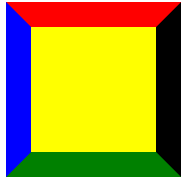
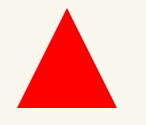
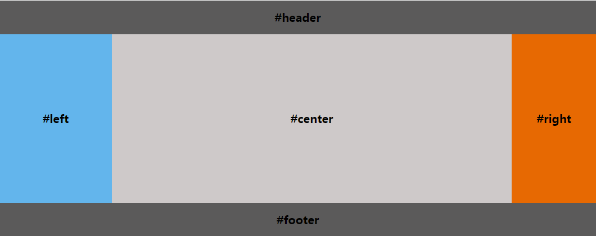
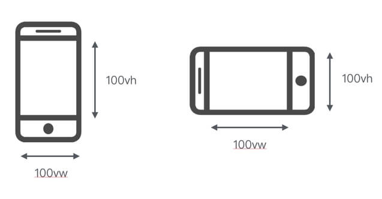

# CSS应用和布局
[[toc]]
## 让一个元素水平垂直居中
假设DOM结构如下：
```html
<div class="father">
    <div class="child">  
    </div>
</div>

<style>
    .father {
        width: 300px;
        height: 300px;
    }
</style>
```

1. child为行内元素时：text-align + line-height
```css
.father{
text-align: center;
line-height: 300px; // 行高设置为父元素高度
}
```
2. child 是块级元素 且 定宽定高：absolute + 负margin
```css
.father{
  position: relative;
}
.child{
  position: absolute;
  top: 50%; // top、left、margin为百分比时参照父元素的高宽
  left: 50%;
  margin: -50px 0 0 -50px; // 50px是child高度的50%
}
/* 或者(固定高宽元素绝对定位时可以用此方法居中) */
.child{
  position: absolute;
  left: 0;
  top: 0; 
  right: 0; 
  bottom: 0;
  margin: auto;
}
```

3. child 高宽不定(高宽都不定基本就不是块级元素) ： absolute + translate
```css
.father{
  position: relative;
}
.child{
  position: absolute;
  top: 50%;
  left: 50%;
  transform: translate(-50%,-50%); // translate百分比依据是元素自身的高宽
}
```

4. child 高宽不定： flex
```css
.father{
  display: flex; 
}
.child{
  justify-content: center;
  align-items: center;
}
```

5. table-cell 居中法
```css
.father{
    display: table-cell;
    text-align: center;
    vertical-align: middle;
}
```

6. grid 居中法

注意和flex居中的写法进行区分
```css
.father{
    display: grid;
    align-items: center;
    justify-items: center;  
}
```


## 使用`border`制作一个三角形
原理：盒模型的四个border接缝处是一个斜边，每一个方向的border都是一个梯形，如下图:



只要合理设置盒子的高宽并将部分边框颜色设置为`transparent`，就可以实现一个三角形。示例代码如下:
```css
#triangle-up{
    width:0;
    height:0;
    border-left:50px solid transparent;
    border-right:50px solid transparent;
    border-bottom:100px solid red;
}
```
效果如下：



扩展问题：分别实现尖头方向朝着上下左右四个部同方向的三角形。

## 实现圣杯布局
圣杯布局由页头、内容、页脚组成，其中内如又分为左中右三栏，如下图：


圣杯布局有以下几点要求
- 上下部之间的部分(container)是一个三栏布局。
- 三栏布局中两侧宽度固定，中间宽度自适应。
- 中间部分在DOM结构上优先，以便先行渲染
- 允许三列中的任意一列成为最高列

假设DOM结构如下：
```html
<div class="header">header</div>
<div class="container">
    <div class="center">center</div>
    <div class="left">left</div>
    <div class="right">right</div>
</div>
<div class="footer">footer</div>
```
### 1. 浮动+相对定位实现
```css
.right, .left, .center{
  float: left;
}
.container{
  padding-left: 200px; // 假设左栏宽200px
  padding-right: 150px; // 假设右栏宽1500px
}
.center{
  width: 100%;
}
.left{
  width: 200px;
  margin-left: -100%; // margin的百分比值参照其包含块的宽度进行计算
  position: relative;
  right: 200px;
}
.right{
  width: 150px;
  margin-right: -150px;
}
.footer{
  clear: both;
}
```
### 2. flex弹性盒子实现
```css
.container {
  display: flex;
}
.center {
  flex: 1;
}
.left {
  width: 200px;        
}
.right {
  width: 150px;           
}
```
## 常见的CSS移动端适配方案有哪些
### `rem`适配方案
这种方案被网易使用：布局使用`rem`作为基本的尺寸单位，js根据设备的屏幕尺寸动态计算出一个`font-size`的值，并将其设置到根节点`<html>`上。

需设置`<meta name="viewport" content="initial-scale=1,maximum-scale=1, minimum-scale=1">`

### `rem` + `viewport`缩放适配方案
这种是淘宝使用的方案：布局使用`rem`作为基本的尺寸单位，除了动态计算出根节点的`font-size`外，还需要根据`DPR`动态修改viewport的缩放比例。

以上两种方案共同点都是需使用`rem`作为布局基本尺寸单位，都需要动态计算`<html>`的`font-size`，且页面中字体大小不使用`rem`。不同点是对viewport的设置不同，计算`<html>`的`font-size`的方法也不同。具体详见[手机端rem布局详解](https://www.cnblogs.com/Sky-Ice/p/9596420.html)

### `vw/vh`适配方案
`vw/vh`是CSS3提出的新从长度单位：
- vw : 1vw 等于视口宽度的1%
- vh : 1vh 等于视口高度的1%



1. 仅使用`vw`适配：根据设计稿尺寸直接换算出以`vw`为单位的元素尺寸，在网页中直接使用换算出的`vw`值。例如：设计稿宽度375px，某元素在设计稿中宽 150px，则它换算成vw的公式为 150px / 375px * 100vw = 10vw

2. 使用`vw`+`rem`适配：根据设计稿计算出`<html>`的`font-size`值，以`vw`作其单位，页面中布局单位依然使用`rem`。例：假设设计稿为750px，我们希望1rem = 设计稿上的100px，计算公式为 100px / 750px * 100vw = 13.3333vw，设置根节点样式为 `html{font-size:13.3333vw}`

兼容性：移动端 ios 8 以上以及 Android 4.4 以上支持
