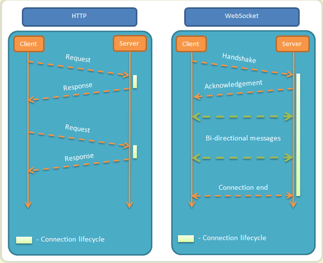

# HTML面试题
[[toc]]
## DOCTYPE的作用是
DOCTYPE是document type的简写，它是一种标记语言的文档类型声明，即告诉浏览器当前 HTML 是用什么版本编写的，DOCTYPE声明必须放到文档的最顶部。[HTML5和HTML4.x的DOCTYPE声明不同之处](#html5中变更或不再建议使用的部分)

### 如果没有写DOCTYPE会怎样
没有写DOCTYPE会让浏览器以[怪异模式](#怪异模式和标准模式有什么区别)渲染网页。

## 对前端语义化的理解
web 语义化是指通过 HTML 标记表示页面包含的信息，包含了 HTML 标签的语义化和 css 命名的语义化。 HTML 标签的语义化是指：通过使用包含语义的标签（如 h1-h6）恰当地表示文档结构。 css 命名的语义化是指：为 html 标签添加有意义的 class、id 补充未表达的语义。

为什么需要语义化：

- 去掉样式后页面呈现清晰的结构
- 盲人使用读屏器更好地阅读
- 搜索引擎更好地理解页面，有利于收录
- 便团队项目的可持续运作及维护

## HTML5有哪些新内容，废除了哪些内容
HTML5新增的内容非常丰富，下面仅列出一些常见的部分：
### 新HTML标签
- 用于媒介回放的 video 和 audio 元素
- 语意化更好的内容元素，比如 article、footer、header、nav、section
- input控件的类型(type)更加丰富，比如calendar、date、time、email、url

### 新的API
- 新的本地储存机制：LocalStorage/SessionStorage/IndexedDB
- Canvas 绘图
- SVG 矢量图
- Drag & Drop 拖放
- HTML Web Worker
- 新的和服务器双向通信方式 WebSocket

### HTML5中变更或不再建议使用的部分
- 移除纯表现的元素basefont ，big，center，font, s，strike，tt，u
- HTML5的DOCTYPE 声明不区分大小写
- HTML5的DOCTYPE 声明内容与之前不同。HTML 4.01 基于 [SGML](https://wiki.mbalib.com/wiki/SGML)，而 HTML 5 不基于 SGML，因此不需要对 DTD 进行引用
    ```html
    <!-- HTML5的DOCTYPE -->
    <!DOCTYPE HTML>
    
    <!-- HTML4的三种DOCTYPE声明，基本不再使用，仅供了解 -->
    <!-- 严格型：不允许使用表现性、废弃元素（如 font）以及 frameset -->
    <!DOCTYPE html PUBLIC "-//W3C//DTD XHTML 1.0 Strict//EN" "http://www.w3.org/TR/xhtml1/DTD/xhtml1-strict.dtd">
    <!-- 过渡型：允许使用表现性、废弃元素（如 font），不允许使用 frameset -->
    <!DOCTYPE html PUBLIC "-//W3C//DTD XHTML 1.0 Transitional//EN" "http://www.w3.org/TR/xhtml1/DTD/xhtml1-transitional.dtd">
    <!-- 框架型：用于框架集网页 -->
    <!DOCTYPE html PUBLIC "-//W3C//DTD XHTML 1.0 Frameset//EN" "http://www.w3.org/TR/xhtml1/DTD/xhtml1-frameset.dtd">
    
    ```

## 怪异模式和标准模式有什么区别
目前浏览器的排版引擎使用三种模式：
- 怪异模式/混杂模式（`Quirks Mode`）
- 接近标准模式（`Almost Standards Mode`）
- 标准模式（`Standards Mode`）

在怪异模式下，排版会模拟 Navigator 4 与 Internet Explorer 5 的非标准行为。为了支持在网络标准被广泛采用前，就已经建好的网站，在标准模式下，表现出行为一般是由 HTML 与 CSS 的规范描述的行为。在接近标准模式下，只有少数的怪异行为被实现。

没有正确的声明`DOCTYPE`可能会触发浏览器的`怪异模式`或`接近标准模式`。

使用`document.compatMode`可以查看当前的浏览器渲染模式，该语句执行后有下面两种结果
- `BackCompat` 文档为怪异模式
- `CSS1Compat` 档处于标准模式或者准标准模式

## 移动端常见的meta标签有哪些，具体的意义是什么

## Viewport是什么?
Viewport(视口)它代表的是浏览器上(也可能是一个app中的WebView)用来显示网页的那部分区域。
一般在桌面设备上，视口大小和浏览器的可视区域大小一致。而移动设备的尺寸一般较小，按照概念又可以分为`Layout Viewport`和`Visual Viewport`:
- `Visual Viewport` 浏览器实际的显示网页部分的尺寸。其宽度可以通过`window.innerWidth`获取。
- `Layout Viewport` 为了避免PC端的网站在移动端小屏幕上布局混乱，移动端浏览器会默认按照一个更大虚拟的视口用于渲染网页，这个虚拟的视口宽度可以通过`document.documentElement.clientWidth`获取。


### 使用meta标签控制移动端Viewport
使用meta标签可以改变浏览器默认的Viewport(这里指的是`Layout Viewport`)。

```html
<meta name="viewport" content="width=device-width, initial-scale=1.0, maximum-scale=1.0, user-scalable=no">
```
该meta标签的作用是让当前viewport的宽度等于设备的宽度，缩放比例为`1.0`，同时不允许用户手动缩放。

下面是meta标签viewport的content内容的一些说明：
|   配置  | 说明  |
|  ----  | ----  |
| width  | 设置layout viewport  的宽度，为一个正整数，或字符串"width-device" |
| initial-scale  | 设置页面的初始缩放值，为一个数字，可以带小数 |
| maximum-scale  | 允许用户的最大缩放值，为一个数字，可以带小数 |
| minimum-scale  | 允许用户的最小缩放值，为一个数字，可以带小数 |
| height  | 设置layout viewport  的高度，这个属性对我们并不重要，很少使用 |
| user-scalable  | 是否允许用户进行缩放，值为"no"或"yes", no 代表不允许，yes代表允许 |

## 前端常见的SEO手段有哪些
1. 正确地设置网页的`title`, `keywords` 和 `description`
    ```html
    <head>
       <title>网页标题</title>
       <meta name="keywords" content="关键词1,关键词2,关键词3"/>
       <meta name="description" content="网站的描述信息"/>
    </head>
    ```
2. 正确地使用语义化标签，让页面结构容易被搜索引擎的爬虫解析。
3. 避免使用`iframe`, 因为搜索引擎爬虫不会去解析`iframe`内的网页
4. 如果网站是`SPA`(单页应用)，网页内容由JS生成，搜索引擎爬虫不易解析，此时应该考虑使用`SSR`(服务端渲染)或`PreRender`(预渲染)

## SVG与Canvas有什么区别
- SVG 是一种使用 XML 描述 2D 图形的语言。
- Canvas 通过 JavaScript 来绘制 2D 图形。
- SVG 基于 XML，这意味着 SVG DOM 中的每个元素都是可用的。您可以为某个元素附加 JavaScript 事件处理器。
- 在 SVG 中，每个被绘制的图形均被视为对象。如果 SVG 对象的属性发生变化，那么浏览器能够自动重现图形。
- Canvas 是逐像素进行渲染的。在 canvas 中，一旦图形被绘制完成，它就不会继续得到浏览器的关注。如果其位置发生变化，那么整个场景也需要重新绘制，包括任何或许已被图形覆盖的对象。

## 说说你对WebSocket的理解和其应用
WebSocket 是 HTML5 开始提供的一种在单个 TCP 连接上进行**全双工**通讯的协议。
### WebSocket和传统HTTP协议有什么不同
- HTTP被设计成无状态的协议，如果没有手动在header中声明`keep-alive`，每次请求完成就会关闭连接。
- WebSocket协议是一种长连接，链接创建后会保持连接状态，并且客户端和服务端可以进行全双工通信，即同一时刻客户端和服务端都可以给对方发送数据，而HTTP做不到服务器主动给客户端推送数据。
- HTTP请求在浏览器中会遇到跨域问题，而发起 WebSocket 没有同源限制，允许跨域。


### 说说WebSocket创建过程
1. 创建WebSocket实例`const ws = new WebSocket('ws://121.40.165.18:8800')`
2. 浏览器通过HTTP发起WebSocket握手请求，这个握手请求和一般的HTTP请求相比在Header中增加了下面几个字段
    ```
    Connection: Upgrade // 告诉服务器，接下来的连接协议需要升级
    Upgrade: websocket // 告诉服务器，具体想升级成websocket协议，平时HTTP如要要使用`keep-alive`也会写到Upgrade字段中
    Sec-WebSocket-Extensions: 
    Sec-WebSocket-Key: 
    Sec-WebSocket-Version: 13   // 客户端支持WebSocket的版本
    ```
3. 服务端返回HTTP状态码为`101(Switching Protocols)`，表示请求接受协议切换到`WebSocket`，连接建立成功。
4. 建立连接之后数据通过TCP上的WebSocket协议进行传输，不在走HTTP协议

### WebSocket如何断线重连

## 说说script标签的async和defer属性有什么不同
在浏览器解析到`<script>`标签时，会停止暂停和渲染文档，转而加载`<script>`内的脚本并解析执行，`async`和`defer`可以让`<script>`在**加载**同时不阻塞DOM的解析。
- `defer` 脚本延迟到文档解析完后再执行
- `async` 加载完成后立刻执行（不论文档是否解析完毕）

可以看出，有`async`属性的`<script>`执行时机是其加载结束后，如果有多个带`async`属性的`<script>`，他们的执行顺序不能得到保证。如果脚本之间有依赖关系，则不建议使用`async`属性。


