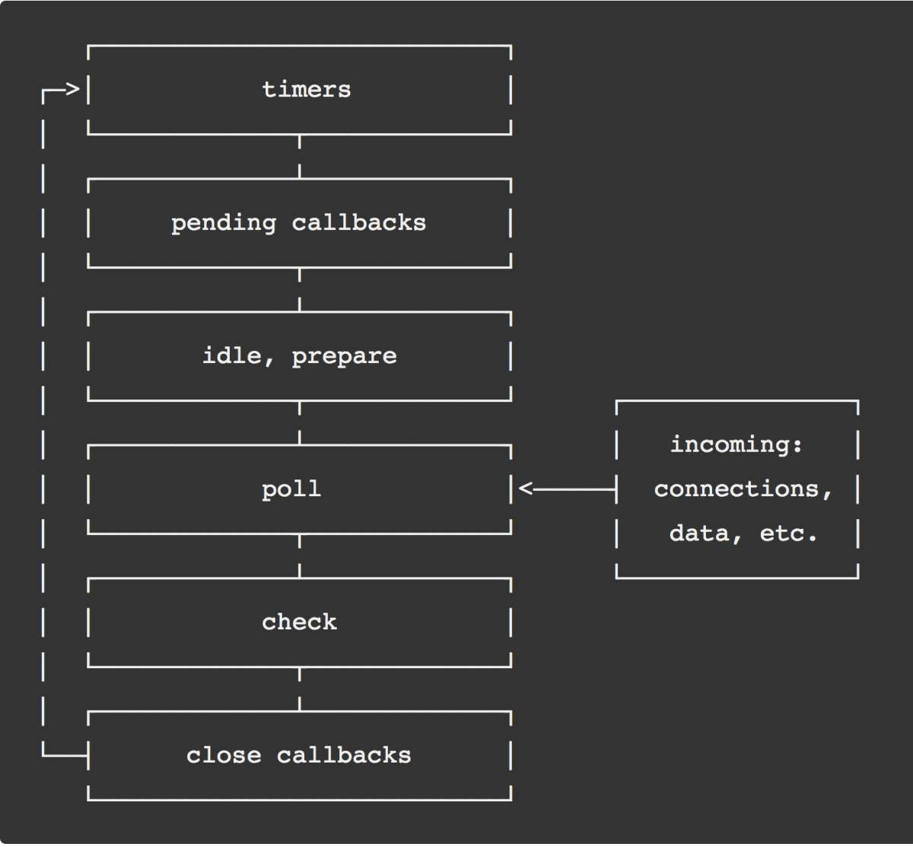

# JavaScript基础

[[toc]]

## JavaScript数据类型有哪些
6种基础数据类型：
- `undefined`
- `null`
- `string`
- `boolean`
- `number`
- `symbol`(ES6中新增)

1种引用类型：
- `object`
## JavaScript中的变量提升
JS中的变量提升(`Hoisting`)是指在JS代码中的函数定义(`function`)和变量声明(`var`)语句在执行时有被提前的效果。

例子：
```javascript
sayHi(); // Hi there!

function sayHi() {
    console.log('Hi there!')
}

name = 'John Doe'
console.log(name);   // John Doe
var name
```
上面例子中，变量`name`和函数`sayHi()`在他们定义之前就被使用了，但是没有报错，原因就是函数定义和变量声明被提前处理了(可以粗略认为被提前到了整段代码顶部);

变量提升有如下这些规则：
1. 函数优先：作用域中的函数定义比起变量声明，函数定义会被提升到变量声明之前
    - 函数定义会被优先提升，但函数变量/函数表达式只会被当做普通变量去提升，例：
    - 函数定义：`function a(){}`
    - 函数变量/函数表达式：`var a = function (){}`
2. `var`声明变量会提前，但赋值语句不会，如果声明前使用了尚未定义的变量，它的值将会是`undefined`
3. 每个**作用域**都会进行提升操作
    - 提升在每个作用域中都会进行，在ES5中，可以被提升到的作用域是**函数级作用域**和**全局作用域**
    - **函数的定义**有例外情况：如果块级作用域(`if语句块`或`try...catch语句块`)中有函数定义，**函数定义**会提升到它所在的**块级作用域**的顶部。而`变量声明`的提升中则没有块级作用域的概念。

::: tip
ES6中的`let`、`const`和`class`不能在声明前被使用，否则会报`ReferenceError`错误。
:::

例题：写出下面代码执行结果
```javascript
var a = 0;
if(true){
    a = 1;
    function a(){}
    a = 21;
    console.log("里面",a);
}
console.log("外部",a);
```
答案：
- `里面 21` 
- `外部 1`

### 为什么会变量提升
JS虽然是动态/解释型语言，但JS代码执行之前会有非常短暂的编译阶段，此时会对JS代码进行词法分析，在词法分析时遇到声明(包括变量定义和函数声明)，这些声明被添加到名为词法环境(`Lexical Environment`)的JavaScript数据结构内并保存在内存中(即将变量和其所在的词法作用域关联起来)，所以这些变量和函数能在它们真正被声明之前使用。

## 什么是词法作用域
词法作用域就是在你写代码时将变量和块作用域写在哪里来决定，也就是词法作用域是静态的作用域，在你书写代码时就确定了。

注意，JS中不是所有的地方都是遵循词法作用域，在使用`eval`和`with`时有其单独的作用域。

## 简单说一下对闭包的理解
在JS中，函数可以记住并访问所在的词法作用域，即使函数在当前词法作用域之外执行，这就产生了闭包。

例子：
```javascript
function outerFunc() {
  let name = 'Tom';

  return function innerFunc() {
    console.log(name);
  }
}

const funcReturned = outerFunc(); // outerFunc执行后返回innerFunc
funcReturned(); // 输出 Tom
```
本例中`innerFunc`定义在`outerFunc`中，所以`innerFunc`即使在`outerFunc`之外被执行时也可以访问`outerFunc`作用域内的变量`name`。

::: details 一道经典的闭包面试题
1. 写出下面代码的输入结果
    ```javascript
    for (var i = 1; i <= 5; i++) {
      setTimeout(function timer() {
        console.log(i);
      }, i * 1000)
    }
    ```
    答案：输出五次数值6
    解析：这里的变量`i`定义成全局变量，在循环结束后，`i`的值是6，又因为setTimeout是内的函数是异步执行的，最后输出了五次i都是数值6

2. 如果想要依次输出数值1到5，上述代码该如何修改?
   - 通过闭包实现：
       ```javascript
        for (var i = 1; i <= 5; i++) {
          ~(function(j) { // 立即执行函数
            setTimeout(function timer() { // 这里形成了闭包
              console.log(j)
            }, j * 1000)
          })(i)
        }
       ```
   - 通过setTimeout第三个参数实现，setTimeout的第三个参数会作为其异步任务函数的参数而被传入。
        ```javascript
        for (var i = 1; i <= 5; i++) {
          setTimeout(
            function timer(j) {
              console.log(j)
            },
            i * 1000, // setTimeout的第二个参数
            i  // setTimeout的第三个参数
          )
        }
        ```
   - 使用ES6中的`let`，在`for`循环中使用`let`定义循环变量时，每次都会产生一个独立块级作用域。
        ```javascript
        for (let i = 1; i <= 5; i++) {
          setTimeout(function timer() {
            console.log(i); // 每次循环都会产生一个块级作用域，其中包含了当前循环变量i
          }, i * 1000)
        }
        ```
:::

## 说说JavaScript中的执行上下文
执行上下文(`Execution Context` 简称 `EC`) 是指JS引擎在运行代码前的做准备工作、为代码执行准备运行环境，例如变量对象的定义、作用域链的扩展、提供调用者的对象引用等信息。

### ES3中的执行上下文
ES3中有三种执行上下文：
- 全局执行上下文：全局唯一的基础执行环境
- 函数执行上下文: 每当一个函数被调用时，都会创建一个新的函数执行上下文
- eval 函数执行上下文: 执行在 eval 函数内部的代码也会有它属于自己的执行上下文

ES3中执行上下文的内容：
- 变量对象 `variable object`：包含当前函数内的arguments、函数声明、变量声明
- 活动对象 `activation object`：函数执行阶段，变量对象被激活为活动对象，此时可以访问到其中的各种属性
- 作用域链 `scope chain`：详见[描述一下JavaScript中的作用域链](#描述一下JavaScript中的作用域链)
- `this` 指向，详见[JavaScript中的`this`指向有哪些情况](#JavaScript中的this指向有哪些情况)

### ES5中的执行上下文
ES5中执行上下文去除了`变量对象`和`活动对象`，取而代之的是词法环境组件（ `LexicalEnvironment component`） 和 变量环境组件（ `VariableEnvironment component`）

- 词法环境组件：一种持有`标识符—变量映射`的结构。这里的`标识符`指的是变量/函数的名字，而`变量`是对实际对象（包含函数类型对象）或原始数据的引用。
- 变量环境组件: 也是一种`词法环境组件`，在ES6中词法环境用于处理函数声明和变量（`let` 和 `const`）绑定，变量环境组件用于处理`var`变量绑定

### 执行上下文栈
当 JS 引擎开始解析脚本代码时，会首先创建一个全局执行上下文，压入栈底（这个全局执行上下文从创建一直到程序销毁，都会存在于栈的底部）。

每当引擎发现一处函数调用，就会创建一个新的函数执行上下文压入栈内，并将控制权交给该上下文，待函数执行完成后，即将该执行上下文从栈内弹出销毁，将控制权重新给到栈内上一个执行上下文。

### 描述一下JavaScript中的作用域链
`作用域`规定了如何查找变量，也就是确定当前执行代码对变量的访问权限。当查找变量的时候，会先从当前上下文的变量对象中查找，如果没有找到，就会从父级（词法层面上的父级）执行上下文的变量对象中查找，一直找到全局上下文的变量对象，也就是全局对象。这样由多个执行上下文的变量对象构成的链表就叫做`作用域链`。

函数的作用域在函数创建时就已经确定了。

详见[面试官：说说执行上下文吧](https://juejin.im/post/5ebced85e51d454dc1467664)

## JavaScript中的`this`指向有哪些情况
1. 函数作为构造函数用，那么其中的this就代表它**即将**`new`出来的对象
2. 如果函数作为对象的一个属性时，并且作为对象的一个属性被调用时，函数中的this指向该对象。即便是在整个原型链中，this代表的也都是当前对象。
3. 当一个函数被`call/apply/bind`调用时，this的值是`call/apply/bind`传入的第一个参数
4. 在全局环境下/普通函数在调用时，this永远是`window`
5. 绑定到DOM上的函数，若DOM传入this，则函数中的this表示该DOM
6. ES6箭头函数中的this，就是定义该箭头函数时所在的包裹环境中的this

## 描述一下JavaScript中的原型和原型链
### `prototype`
在JS中，每个函数都有一个`prototype`属性，被常作为原型，这是一个显式原型属性，它的值也是一个对象，所以又称为原型对象。
```javascript
function Animal(){};
Animal.prototype; // 原型
Animal.prototype.constructor === Animal; // true
```
`prototype`原型对象上，有以下几个重要的属性
- `constructor` 构造函数，指向拥有该原型对象的函数

### `__proto__`
每个对象，都有一个隐藏属性`__proto__`，指向创建该对象的构造函数的原型：
```javascript
const dog = new Animal(); // Animal是dog对象的构造函数
dog.__proto__ === Animal.prototype; // true, Animal.prototype是dog的原型
```

注意: `prototype`也是一个对象，所以它也有`__proto__`隐藏属性。

### 属性查找机制和原型链
在访问一个对象的属性时，首先会查找对象本身是否有该属性，如果没有，则会沿着对象的`__proto__`属性，一层一层向上查找，直到访问到`Object.prototype`为止，因为`Object.prototype.__proto__`是`null`，无法再继续访问。

至此可以给出原型链的概念：原型链是由对象`__proto__`属性连成的链条，`Object.prototype.__proto__`是原型链的顶端。

如下图：


由于`__proto__`是隐藏属性，并不规范，JS中给出了`Reflect.getPrototypeOf()` 与 `Object.getPrototypeOf()` 用于返回一个对象的原型

## ES5中实现继承
在ES6的class出现后，ES5的继承使用的没有以前那么多了，这部分建议仅供了解，下面列举一些常见的ES5实现继承的方式：
1. 类式继承，子类的`prototype`为父类的一个实例。
缺点：如果父类的共有属性是引用类型，那父类的共有属性就会在**子类的所有实例**中共用，容易造成修改的混乱，且在在继承时，父类的共有属性是固定的，无法通过传参修改。
```javascript
// 声明父类
function Father() {
  this.age = 30;
}
// 添加父类的共有方法
Father.prototype.getAge = function() {
  return this.age; // 父类的共有属性
}
// 声明子类
function Son() {
  this.name = 'tom';
}
// 继承父类
Son.prototype = new Father();
```

2. 构造函数继承，在子类中调用父类的构造函数。
```javascript
// 声明父类
function Father(id) {
  this.id = id;
  this.books = ['html', 'css', 'js'];
}
// 添加父类的方法
Father.prototype.getBooks = function() {
  return this.books;
}
// 声明子类
function Son(id) {
  Father.call(this, id); // 继承父类
}
```
有点是可以对父类构造函数进行传参，缺点是父类`prototype`上的方法没有被子类继承到。

3. 组合继承，结合了上面两种继承方法的优点
```javascript
// 声明父类
function Father(id) {
  this.id = id;
  this.books = ['html', 'css', 'js'];
}
// 添加父类的方法
Father.prototype.getBooks = function() {
  return this.books;
}

// 声明子类
function Son(id) {
  Father.call(this, id); // 继承父类的共有属性
}
Son.prototype = new Father(); // 继承父类的方法
```

4. 原型式继承，利用JS自带的原型链实现继承，缺点是父对象的共有属性如果是引用类型的依然会被所有子类的实例共享。
```javascript
function inheritObj(obj) {
  // 声明一个过渡的函数对象
  function F() {};
  // 过度对象的原型为父类对象
  F.prototype = obj;
  // 返回过渡对象的一个实例，该实例继承了父对象
  return new F();
}
// 使用方法
// 父对象
var book = {
  name: 'css book',
  tags: ['css', 'style']
}
var newBook = inheritObj(book);

```
注意，原型式继承的父类是一个普通的对象

5. 寄生式继承，对原型式继承的一种封装
```javascript
var book = {
  name: 'css book',
  tags: ['css', 'style']
}
function createBook(bookObj) {
  // 先通过原型继承创建新对象
  var tempObj = inheritObj(bookObj);
  // 添加方法
  tempObj.getName = function() {
    return this.name;
  }
  // 返回创建的新对象
  return tempObj;
}
```
缺点：使用该继承方式，在为对象添加函数的时候，没有办法做到函数的复用。

6. 寄生组合式继承，结合了寄生式与组合式的优点
```javascript
// 先定义一个工具函数
function inheritPrototype(subClass, superClass){
  // 将父类的原型复制一份
  var prototype = inheritObj(superClass.prototype);
  // 修正因重写subClass原型导致constructor不正确
  prototype.constructor = subClass;
  // 给子类设置新的原型
  subClass.prototype = prototype;
}

// 使用方法：
// 声明父类
function Father(id) {
  this.id = id;
  this.books = ['html', 'css', 'js'];
}
// 添加父类的方法
Father.prototype.getBooks = function() {
  return this.books;
}

// 声明子类
function Son(id) {
  Father.call(this, id); // 继承父类的共有属性
}
// 寄生式继承父类的原型
inheritPrototype(Son, Father)
```

## 判断一个对象的类型有哪些方法
1. `typeof`操作符，常用来判断基本数据类型，例子：
```javascript
typeof 0;  //number;
typeof true;  //boolean;
typeof undefined;  //undefined;
typeof "hello world"   //string;
typeof function(){};   //function;

typeof null; //object
typeof {};  //object;
typeof []; //object
```
不足：`typeof`判断对象、数组、null都为`object`

2. `instanceof`操作符，主要是用于判断引用类型是否是某个父类型的实例
```javascript
const a = {};
a instanceof Object;  //true
a instanceof Array;     //false
```
原理：`instanceof`会在左侧值的原型链上查右侧值的`prototype`，如果找到就返回true

3. `constructor`属性：实例对象的`__proto__.constructor` 会指向该实例的构造函数
4. `Object.prototype.toString.call()`
```javascript
Object.prototype.toString.call(123); //"[object Number]"

Object.prototype.toString.call('str'); //"[object String]"

Object.prototype.toString.call(true); //"[object Boolean]"

Object.prototype.toString.call({}); //"[object Object]"

Object.prototype.toString.call([]); //"[object Array]"
```

## 说说JS中的隐式转换
JS中的隐式转换(隐式强制转换)：某些情况下，JS中的数据类型不符合运算要求，此时会**自动地**将数据类型进行转换然后在进行运算。

例子：
```javascript
// 转化为数字
+'0.5'; // 输出数字0.5
'100' == 100; // 输出true，左侧字符串被转换为数字
// 转化为字符串
100 + '100'; // 输出'100100' 左侧数字被转换成字符串
[1,2,3] == '1,2,3'; // 输出true，左侧字符串被转换为字符串
```

## == 和 === 有什么区别
`==`和`===`操作符都是用于判断两个值是否相等，他们的主要区别如下
- 如果`===`两侧的值类型不一致，则返回`false`
- 如果`==`两侧的值类型不一致，则会先尝试将值进行隐式类型转换，然后在进行比较
    - 如果一个值是数字另一个是字符串，将字符串转换为数字进行比较
    - 如果有布尔类型，将true 转换为 1，false 转换为 0，然后用==规则继续比较
    - 如果一个值是对象，另一个是数字或字符串，将对象转换为原始值(调用`toString()`或`valueOf()`)然后用`==`规则继续比较

下图总结了宽松相等`==`的一些隐式转换结果，途中绿色区块为true


## JavaScript中的严格模式是什么
严格模式是一种 ES5 添加的（严格）运行模式，这种模式使得 Javascript 在更严格的条件下运行。

进入"严格模式"的标志 `"use strict";`

设立"严格模式"的目的，主要有以下几个：
- 消除 Javascript 语法的一些不合理、不严谨之处，减少一些怪异行为;
- 消除代码运行的一些不安全之处，保证代码运行的安全；
- 提高编译器效率，增加运行速度；
- 为未来新版本的 Javascript 做好铺垫。

详见[《Javascript 严格模式详解》](http://www.ruanyifeng.com/blog/2013/01/javascript_strict_mode.html)

严格模式和一般模式的主要区别：
- 禁止使用 with 语句。
- 禁止 this 关键字指向全局对象
- 对象不能有重名的属性

## JavaScript中为什么0.1 + 0.2 !== 0.3
JS中的数值实现遵循[IEEE 754](https://baike.baidu.com/item/IEEE%20754)标准，使用64位固定长度来表示数值，

0.1 和 0.2 在转换为二进制表示的时候会出现位数无限循环的情况，JS在计算时将会进行截取，造成精度丢失，出现0.1 + 0.2 !== 0.3的结果。

关于JS中浮点数如何储存，详见[《0.1+0.2 !== 0.3？》](https://juejin.im/post/5bd2f10a51882555e072d0c4)

### 如何解决JS中浮点数不精确的问题
1. 将浮点数转换成整数进行计算，再将计算结果除以相应的倍数，如计算`0.1+0.2`，先转化为 1 + 2 = 3，再将结果除以10，得到0.3。要注意除法和乘法的处理。
2. 使用[`number-precision`](https://github.com/nefe/number-precision)库

## 说说JavaScript中的事件循环(`Event Loop`)
因为 js 是单线程运行的，在代码执行的时候，通过将不同函数的执行上下文压入执行栈中来保证代码的有序执行。在执行同步代码的时候，如果遇到了异步事件，js 引擎并不会一直等待其返回结果，而是会将这个事件挂起，继续执行执行栈中的其他任务。当异步事件执行完毕后，再将异步事件对应的回调加入到与当前执行栈中不同的另一个任务队列中等待执行。任务队列可以分为宏任务对列和微任务对列，当当前执行栈中的事件执行完毕后，js 引擎首先会判断微任务对列中是否有任务可以执行，如果有就将微任务队首的事件压入栈中执行。当微任务对列中的任务都执行完成后再去判断宏任务对列中的任务。

微任务包括了 promise 的回调、node 中的 process.nextTick 、对 Dom 变化监听的 MutationObserver。

宏任务包括了 script 脚本的执行、setTimeout ，setInterval ，setImmediate 一类的定时事件，还有如 I/O 操作、UI 渲染等。


## node中的事件循环
node中事件循环的实现是依靠的`libuv`引擎，node选择chrome v8引擎作为js解释器，v8引擎将js代码分析后去调用对应的node api，而这些api最后则由`libuv`引擎驱动。如下图：


Node的Event loop一共分为6个阶段：
- `timers`(定时器): 这个阶段执行定时器队列中的回调如 `setTimeout()` 和 `setInterval()`
- `pending callbacks`:上一轮循环中少数的`I/O callback`会延迟放在这一阶段执行
- `idle, prepare`(闲置，准备): 此阶段只在内部使用
- `poll`(轮询): 最重要的阶段，在这一阶段`执行I/O回调`和`处理轮询队列中的事件`，此阶段几乎会执行几乎所有的回调函数，除了`close callbacks`和那些由 `timers` 与 `setImmediate()` 调度的回调
- `check`(检查): `setImmediate()` 设置的回调会在此阶段执行(`setImmediate()是将事件插入到事件队列尾部，主线程和事件队列的函数执行完成之后立即执行setImmediate指定的回调函数`)
- `close callbacks`(关闭事件的回调): 一些关闭事件的回调在此阶段进行，例如 `socket.on('close', ...)`.



## `apply`、`call`、`bind` 之间有什么区别
`apply`、`call`、`bind`都是为了改变函数调用时`this`的指向。
- `apply`和`call`用法很像，主要区别是传入的参数不一样，apply的第二个参数是数组，适用于参数较多的情况
    ```javascript
    fun.call(thisArg, arg1, arg2, ...);
    fun.apply(thisArg, [argsArray]);
    ```
- `bind`会改变函数的`this`并返回一个新函数，而`apply`、`call`对函数调用会立刻执行，`bind`的传参和`call`是一样的
    ```javascript
    fun.bind(thisArg[, arg1[, arg2[, ...]]]);
    ```
::: tip
- 经过`bind`绑定了新`this`后返回的函数，当使用`new`操作符调用绑定函数时，绑定的新`this`无效。
- call/apply/bind均无法改变箭头函数的This
:::
## 手写实现`apply`、`call`、`bind`
### 实现`call`
```javascript
Function.prototype.myCall = function(context) {
  context = context || window
  context.fn = this
  const args = [...arguments].slice(1)
  const result = context.fn(...args)
  delete context.fn
  return result
}
```
### 实现`apply`
```javascript
Function.prototype.myApply = function(context) {
  if (typeof this !== 'function') {
    throw new TypeError('Error')
  }
  context = context || window
  context.fn = this
  let result
  // 处理参数和 call 有区别
  if (arguments[1]) {
    result = context.fn(...arguments[1])
  } else {
    result = context.fn()
  }
  delete context.fn
  return result
}
```
### 实现`bind`
这里使用`apply`来模拟`bind`
```javascript
Function.prototype.myBind = function (context) {
  if (typeof this !== 'function') {
    throw new TypeError('Error')
  }
  const _this = this
  const args = [...arguments].slice(1)
  // 返回一个函数
  return function F() {
    // 因为返回了一个函数，我们可以 new F()，所以需要判断
    if (this instanceof F) {
      return new _this(...args, ...arguments)
    }
    return _this.apply(context, args.concat(...arguments))
  }
}
```
## 什么是节流(`throttle`)和防抖(`debounce`)，手动实现节流和防抖
### 防抖 debounce
在事件被触发n秒后再执行回调，如果在这n秒内又被触发，则重新计时。
```
function debounce(fun, delay) {
    return function (args) {
        let that = this
        let _args = args
        clearTimeout(fun.id)
        fun.id = setTimeout(function () {
            fun.call(that, _args)
        }, delay)
    }
}
```
### 节流 throttle

规定在一个单位时间内，只能触发一次函数。如果这个单位时间内触发多次函数，只有一次生效。
```
  function throttle(fun, delay) {
        let last, deferTimer
        return function (args) {
            let that = this
            let _args = arguments
            let now = +new Date()
            if (last && now < last + delay) {
                clearTimeout(deferTimer)
                deferTimer = setTimeout(function () {
                    last = now
                    fun.apply(that, _args)
                }, delay)
            }else {
                last = now
                fun.apply(that,_args)
            }
        }
    }
```
### 节流和防抖应用场景
- debounce
search搜索联想，用户在不断输入值时，用防抖来节约请求资源。
window触发resize的时候，不断的调整浏览器窗口大小会不断的触发这个事件，用防抖来让其只触发一次
- throttle
鼠标不断点击触发，mousedown(单位时间内只触发一次)
监听滚动事件，比如是否滑到底部自动加载更多，用throttle来判断

## 实现对象浅拷贝和深拷贝
### 浅拷贝
只会拷贝对象最外部的一层，深层次的对象级别的就拷贝引用。浅拷贝有如下几种方法：

1. 循环复制对象属性
```javascript
function simpleClone(initalObj) {
    var obj = {};
    for ( let i in initalObj) {
        obj[i] = initalObj[i];
    }
    return obj;
}
```
2. ES6解构
```javascript
let a = {
  age: 1
}
let b = { ...a }
```
3. `Object.assign()`
```javascript
let a = {
  age: 1
}
let b = Object.assign({}, a)
```
### 深拷贝
1. `JSON.parse()` + `JSON.stringify()` 实现深拷贝：
```javascript
let a = {
  age: 1,
  jobs: {
    first: 'FE'
  }
}
let b = JSON.parse(JSON.stringify(a));
```
这是目前比较流行的写法，简单快捷。但是该方法是一些局限性的：
- 会忽略 undefined
- 会忽略 symbol
- 不能序列化函数
- 不能解决循环引用的对象

2. 递归拷贝对象的属性
```javascript
// isObject是帮助函数，用于判断一个值是对象还是函数。
function isObject(o) {
  return (typeof o === 'object' || typeof o === 'function') && o !== null
}

function deepClone(obj) {
  if (!isObject(obj)) {
    throw new Error('非对象')
  }
  let isArray = Array.isArray(obj);
  let newObj = isArray ? [...obj] : { ...obj };
  Reflect.ownKeys(newObj).forEach(key => {
    newObj[key] = isObject(obj[key]) ? deepClone(obj[key]) : obj[key];
  })

  return newObj;
}
```
这是一个简单版本深克隆，只考虑了引用类型是简单对象、数组，实际上还有很多的其他边界情况需要考虑，比如防止循环引用、函数的复制、处理Date对象、处理RegExp对象等。

## 说说前端储存数据 Cookie、localStorage、sessionStorage、IndexDB
localStorage、sessionStorage、IndexDB是HTML5新推出的API，用于前端储存数据。
- localStorage、sessionStorage是以字符串键值对的方式储存数据，sessionStorage 在窗口关闭前有效，localStorage 长期有效，直到用户删除
- IndexedDB 就是浏览器提供的本地数据库，允许储存大量数据，支持二进制储存，提供查找接口，还能建立索引。详见[浏览器数据库 IndexedDB 入门教程](http://www.ruanyifeng.com/blog/2018/07/indexeddb.html)
- `cookie` 会在请求时发送到服务器，作为会话标识，服务器可修改 `cookie`，cookie 在设置的有效期内有效，默认为浏览器关闭
- Cookie、localStorage、sessionStorage、IndexDB 均受同源策略限制，无法跨域。

|  特性	 | cookie| 	localStorage| sessionStorage| indexDB |
| --- | -- | -- | -- | -- |
| 数据生命周期 | 一般由服务器生成，可以设置过期时间 | 除非被清理，否则一直存在	页面关闭就清理 |	除非被清理，否则一直存在 | 除非被清理，否则一直存在 | 
| 数据存储大小 | 4K | 5M |	5M | 不超过浏览器允许占用的磁盘空间，详见[IndexedDB 浏览器存储限制和清理标准](https://developer.mozilla.org/zh-CN/docs/Web/API/IndexedDB_API/Browser_storage_limits_and_eviction_criteria) |
| 与服务端通信 | 每次都会携带在 header 中 |	不参与 | 不参与	| 不参与 |

## escape,encodeURI,encodeURIComponent 有什么区别？
`escape()`、`encodeURI()`和`encodeURIComponent()`作用是用于将字符串编码成十六进制转义序列。目前`escape`已被废弃，不再推荐使用，这几个函数**主要区别是各自的适用范围不同**：
- `escape`不会对ASCII字母和数字进行编码，也不会对`- _ . ! ~ * ' ( )`这些字符进行编码
- `encodeURI`适用于完整的URI进行编码，**不会**对ASCII字母、数字、和如下字符`~!@#$&*()=:/,;?+'`进行编码
- `encodeURIComponent`适用于对URI的片段进行编码，比如协议、主机名、路径或查询字符串，**不会**对ASCII字母、数字、和如下字符`~!*()'`进行编码

## JavaScript的垃圾回收机制是怎样的
V8将内存分为新生代和老生带：

### 新生代
新生代中的对象一般存活时间较短，使用 Scavenge GC 算法。新生代空间又分为两部分：`From`空间和`To`空间。在这两个空间中，必定有一个空间是使用的，另一个空间是空闲的。新分配的对象会被放入 From 空间中，当 From 空间被占满时，检查 From 空间中活跃的对象并复制到 To 空间中，然后清空From空间， 交换From空间和To空间，开始下一轮。

### 老生带
对象从新生代移动到老生代的过程叫作`晋升`。

对象晋升的条件主要有两个：
- 如果一个对象是第二次经历从From空间复制到To空间，那么这个对象会被移动到老生代中
- 当要从From空间复制一个对象到To空间时，如果To空间已经使用了超过25%，则这个对象直接晋升到老生代中。因为如果占比过高，会影响后续的内存分配。

老生带中的对象有标记清除标记压缩算法进行垃圾回收。
- 标记清除(`Mark-Sweep`) 标记清除分为标记和清除两个阶段。在标记阶段需要遍历堆中的所有对象，并标记那些活着的对象，然后进入清除阶段。在清除阶段总，只清除没有被标记的对象。
- 标记压缩(`Mark-Compact`) 标记整理正是为了解决标记清除所带来的内存碎片的问题。标记整理在标记清除的基础进行修改，将其的清除阶段变为紧缩极端。在整理的过程中，将活着的对象向内存区的一段移动，移动完成后直接清理掉边界外的内存。


进一步了解见[浅谈V8引擎中的垃圾回收机制](https://segmentfault.com/a/1190000000440270)

### 哪些行为可能会造成内存泄漏
- 意外的全局变量
- 被遗忘的计时器或回调函数
- 闭包
- 没有清理的DOM元素引用

## 如何处理跨域
### 什么是跨域
跨域是因为浏览器的同源策略(`Same Origin Policy`)限制。同源策略会阻止一个域的JS脚本和另外一个域的内容进行交互。所谓同源（即指在同一个域）就是两个页面具有相同的协议（`protocol`），主机（`host`）和端口号（`port`）

同源策略主要限制了以下几点：
- 无法读取非同源网页的 Cookie、LocalStorage、SessionStorage 和 IndexedDB
- 无法接触非同源网页的 DOM
- 无法向非同源地址发送 AJAX 请求

跨域一般指的是前端想要和非本域的内容进行交互，跨域目前有下面几种解决方案
### `JSONP`
JSONP主要原理是通过浏览器`<script>`标签的`src`能够加载跨域脚本。

核心思想：网页通过添加一个`<script>`元素，向服务器请求 JSON 数据，服务器收到请求后，将数据放在一个指定名字的回调函数的参数位置传回来

优点是兼容性好，缺点是只支持`get`请求
```html
<script src="http://test.com/data.php?callback=dosomething"></script>
// 向服务器test.com发出请求，该请求的查询字符串有一个callback参数，用来指定回调函数的名字
 
// 处理服务器返回回调函数的数据
<script type="text/javascript">
    function dosomething(res){
        // 处理获得的数据
        console.log(res.data)
    }
</script>
```
### `CROS`
`CORS`是一个W3C标准，全称是"跨域资源共享"（Cross-origin resource sharing）, 它允许浏览器向跨域服务器，发出AJAX请求。

浏览器将 `CORS` 请求分成两类：简单请求和非简单请求。

对于简单请求，浏览器直接发出 `CORS` 请求。具体来说，就是会在请求头中，增加 `Origin` 字段用来说明本次请求来自哪个源。服务器根据这个值，决定是否同意这次请求。对于如果 `Origin` 指定的源，不在许可范围内，服务器会返回一个正常的 HTTP 回应。浏览器发现，这个回应的头信息没有包含 `Access-Control-Allow-Origin` 字段，就知道出错了，从而抛出一个错误，ajax 不会收到响应信息。如果成功的响应头会包含`Access-Control-Allow-Origin`、`Access-Control-Allow-Credentials`、`Access-Control-Expose-Headers` 等字段。

非简单请求，浏览器会先发出一次预检请求(`OPTIONS`请求)，来判断该域名是否在服务器的白名单中，如果收到肯定回复后才会发起请求。

详见：[跨域资源共享 CORS 详解](http://www.ruanyifeng.com/blog/2016/04/cors.html)

### 设置`document.domain`
因为浏览器是通过document.domain属性来检查两个页面是否同源，因此只要通过设置相同的document.domain，两个页面就可以共享Cookie，此方案仅限主域相同，子域不同的跨域应用场景。
```javascript
document.domain = 'test.com';
```
### `window.postMessage()`
调用postMessage方法实现父窗口向子窗口发消息（子窗口同样可以通过该方法发送消息给父窗口）

适用场景：
- 页面和其打开的新窗口的数据传递
- 多窗口之间消息传递
- 页面与嵌套的`iframe`消息传递
```javascript
// 打开'http://test2.com'窗口并向其发送消息
const openWindow = window.open('http://test2.com', 'title');
openWindow.postMessage('Nice to meet you!', 'http://test2.com');

// 监听来自别的窗口发来的消息
window.addEventListener('message', function (e) {
  console.log(e.source); // e.source 发送消息的窗口
  console.log(e.origin); // e.origin 消息发向的网址
  console.log(e.data);   // e.data   发送的消息
},false);
```

### `WebSocket`
`WebSocket`连接是没有同源限制的，所以天然可以跨域。

### 后端转发请求
同源策略是浏览器的安全功能，而服务端发起请求是没有同源限制的，所以可以让服务器转发来自前端的请求，达到跨域的目的。

## `ES module`和`CommonJS`区别
- `CommonJS`是服务端模块的规范，Nodejs采用这个规范。
- `ES module`是ES6中提出的js模块化方案
- `CommonJS` 模块是运行时加载，ES6 模块是编译时输出接口。
- `CommonJS` 加载的是整个模块，即将所有的接口全部加载进来，ES6 可以单独加载其中的某个接口（方法），
- `CommonJS` this 指向当前模块，`ES6`中this 指向undefined
- `CommonJS` 模块输出的是一个值的拷贝(浅拷贝)，ES6 模块输出的是值的引用。
- ES6的import 语句不能放在if语句块里，不然会报错，nodejs的require可以放在if里

## 实现instanceOf
```javascript
function myInstanceof(left, right) {
  let prototype = right.prototype
  left = left.__proto__
  while (true) {
    if (left === null || left === undefined)
      return false
    if (prototype === left)
      return true
    left = left.__proto__
  }
}
```
## 实现一个EventBus
```javascript
class EventEmeitter {
  constructor() {
    this._events = this._events || new Map(); // 储存事件/回调键值对
    this._maxListeners = this._maxListeners || 10; // 设立监听上限
  }
}

// 触发名为type的事件
EventEmeitter.prototype.emit = function(type, ...args) {
  let handler;
  handler = this._events.get(type);
  if (Array.isArray(handler)) {
    // 如果是一个数组说明有多个监听者,需要依次此触发里面的函数
    for (let i = 0; i < handler.length; i++) {
      if (args.length > 0) {
        handler[i].apply(this, args);
      } else {
        handler[i].call(this);
      }
    }
  } else {
    // 单个函数的情况我们直接触发即可
    if (args.length > 0) {
      handler.apply(this, args);
    } else {
      handler.call(this);
    }
  }

  return true;
};

// 监听名为type的事件
EventEmeitter.prototype.addListener = function(type, fn) {
  const handler = this._events.get(type); // 获取对应事件名称的函数清单
  if (!handler) {
    this._events.set(type, fn);
  } else if (handler && typeof handler === "function") {
    // 如果handler是函数说明只有一个监听者
    this._events.set(type, [handler, fn]); // 多个监听者我们需要用数组储存
  } else {
    handler.push(fn); // 已经有多个监听者,那么直接往数组里push函数即可
  }
};

EventEmeitter.prototype.removeListener = function(type, fn) {
  const handler = this._events.get(type); // 获取对应事件名称的函数清单

  // 如果是函数,说明只被监听了一次
  if (handler && typeof handler === "function") {
    this._events.delete(type, fn);
  } else {
    let postion;
    // 如果handler是数组,说明被监听多次要找到对应的函数
    for (let i = 0; i < handler.length; i++) {
      if (handler[i] === fn) {
        postion = i;
      } else {
        postion = -1;
      }
    }
    // 如果找到匹配的函数,从数组中清除
    if (postion !== -1) {
      // 找到数组对应的位置,直接清除此回调
      handler.splice(postion, 1);
      // 如果清除后只有一个函数,那么取消数组,以函数形式保存
      if (handler.length === 1) {
        this._events.set(type, handler[0]);
      }
    } else {
      return this;
    }
  }
};
```
## 模拟new的实现
`new`操作符做了这些事
- 创建了一个新的对象
- 将新对象的`__proto__`连接到构造函数的`prototype`
- 将新对象绑定为构造函数的`this`并执行构造函数
- 如果构造函数有返回值，则`new`的结果为构造函数的返回值，否则返回之前创建的新对象。
```javascript
function create() {
  let obj = {}
  let Constructor = [].shift.call(arguments)
  obj.__proto__ = Constructor.prototype
  let result = Constructor.apply(obj, arguments)
  return result instanceof Object ? result : obj
}
```
使用方法：`create(构造函数, 参数1, 参数2, ...)`
## 实现Object.create()
Object.create()方法创建一个新对象，使用现有的对象来提供新创建的对象的__proto__
```javascript
function myCreate(obj) {
  function F() {};
  F.prototype = obj;
  return new F();
}
```
::: tip
`Object.create()`可以用于实现类式继承
:::

## 实现flat
flat函数的作用是将嵌套的数组展开，如：
```javascript
flat([1, [2, [3, [4]]]])
// 输出
[1, 2, 3, 4]
```
flat函数有很多种实现，下面仅列举一些常见的：
```javascript
// 递归实现
function flat(arr) {
  const result = [];

  for (const item of arr) {
    if (Array.isArray(item)) {
      result.push(...flat(item))
    } else {
      result.push(item);
    }
  }

  return result;
}

// 非递归使用while实现
function flat2(arr) {
  const res = [];
  const stack = arr.reverse().slice();

  while (stack.length > 0) {
    const top = stack.pop();
    if (Array.isArray(top)) {
      stack.push(...top.reverse());
    } else {
      res.push(top);
    }
  }
  return res;
}

// 利用concat函数实现
function flat3(arr) {
  return [].concat(...arr.map(v => Array.isArray(v) ? [].concat(flat3(v)) : v));
}
```

## 数组去重
1. 利用ES6中的Set去重
```javascript
function unique(arr) {
    return Array.from(new Set(arr))
}
```
2. 利用ES6中Map的Key不能重复特点进行去重
```javascript
function unique(arr) {
    let map = new Map();
    let result = []
    for (let item of arr) {
        if (map.has(item)) {      // 判断是否存在该key值
            map.set(item, true);
        } else {
            map.set(item, false);
            result.push(item);
        }
    }
    return result;
}
```
3. 利用filter，在循环中判断数组元素是否为初次出现来过滤重复数组元素
```javascript
function unique( arr ){
    // 如果新数组的当前元素的索引值 == 该元素在原始数组中的第一个索引，则返回当前元素
    return arr.filter(function(item,index){
        return arr.indexOf(item,0) === index;
    });
}
```
4. 利用数组includes判断元素是否重复
```javascript
function unique( arr ){
    let result = [];
    for(let item of arr){
        if( !result.includes(item) ){
            result.push(item);
        }
    }
    return result;
}
```

## 说说浏览器中的事件机制
当在DOM中出发一些事件时，事件在DOM树中的传递会有两个过程：捕获过程和冒泡过程。

- 首先发生的是捕获过程，事件会从最顶层的`window`向下传递，直到到达触发该DOM的元素。
- 之后发生的是冒泡过程，事件会从触发事件的元素向上传递，如冒泡一般，传递到`window`为止

不是所有事件都会冒泡，如blur、focus、mouseleave、mouseenter、resize、scroll等事件都是不会冒泡的。

### 如何取消冒泡和取消事件的默认行为
- 取消冒泡：`event.stopPropagation()`(chrome、firefox支持) 或 `event.cancelBubble = false`(IE支持)
- `event.stopImmediatePropagation()` 当一个DOM上对某事件绑定了多个监听函数时，如果其中一个监听函数中调用了`stopImmediatePropagation`，则其他的监听函数将不会再执行。
- 取消事件默认行为：`event.preventDefault()`

### 什么是事件委托
如果想给一个父容器内的大量子元素进行相同的事件绑定，则可以将监听器绑定在父容器上，而不是每个子元素单独设置监听器。这种技术称之为事件委托。

事件委托利用了事件冒泡的特性，例子，有如下HTML代码：
```html
<ul>
    <li>1</li>
    <li>2</li>
    <li>3</li>
</ul>
```
通过事件委托绑定监听器：
```javascript
document.querySelector('ul').addEventListener((event) => { 
    // do something here
    console.log(event.target);
    console.log(event.currentTarget)
})
```
我们可以通过回调函数中的`event`对象来辨别出事件的来源：
- `event.target` 实际触发该事件的节点
- `event.currentTarget` 当前处理该事件的元素，即当前监听器所绑定的元素(在上面例子中即为父元素`<ul>`)
